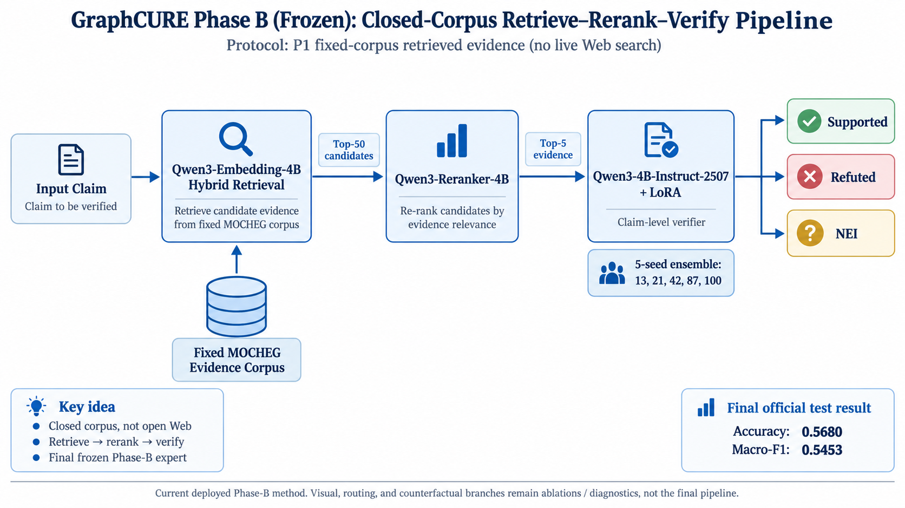

# GraphCURE Phase B — Báo cáo chi tiết từ B1 đến B18

**Trạng thái:** Phase B đã đóng băng  
**Bài toán:** Multimodal fact verification trên MOCHEG  
**Protocol chính của Phase B:** P1 — fixed-corpus / system-retrieved evidence  
**Final frozen expert:** B18-A grounded-explanation heterogeneous ensemble  
**Kết quả official test hiện tại:** Accuracy **0.57535**, Macro-F1 **0.55507**  
**Kết quả strict deduplicated test:** Accuracy **0.57477**, Macro-F1 **0.55383**  
**Kết luận tổng quát:** B2–B17 đã thử nhiều hướng phức tạp hơn B1 nhưng chưa hướng nào vượt B1 một cách ổn định dưới matched controls và independent confirmation.

---

## Cập nhật B18 — kết luận hiện hành

Báo cáo B1–B17 bên dưới giữ nguyên lịch sử hypothesis testing và các negative
results. Những câu “freeze tại B1” hoặc “không mở B18” trong phần lịch sử chỉ
áp dụng cho việc không tiếp tục khai thác hậu nghiệm B16/B17 trên cùng folds;
chúng đã được **thay thế** bởi fresh B18-A cycle.

B18-A dùng teacher-generated grounded explanations làm supervision bổ sung,
nhưng lúc inference vẫn dự đoán trực tiếp verdict A/B/C. Năm candidate seed
được xếp hạng trên validation; top-3 seed `100/87/42` được khóa trước khi ghép
với năm seed B1. Trên P1 official `n=2442`, ensemble đạt Accuracy `0.57535`,
Macro-F1 `0.55507`, tăng `+0.00737/+0.00976` so với B1. Paired bootstrap so
với B1 cho CI `[+0.00097,+0.01850]`, `P(Δ>0)=0.9839`. Vì vậy B18-A là final
Phase-B champion; B1 là frozen baseline và B2–B17 là ablation/failure analysis.

## 1. Mục đích của tài liệu

Tài liệu này tổng hợp toàn bộ Phase B của GraphCURE theo góc nhìn nghiên cứu, không chỉ liệt kê kết quả. Mỗi nhánh B1–B17 được giải thích theo cùng một cấu trúc:

1. **Vấn đề đang muốn giải quyết là gì?**
2. **Tại sao tại thời điểm đó lại chọn thử hướng này?**
3. **Đã thay đổi gì so với anchor/baseline?**
4. **Kết quả định lượng ra sao?**
5. **Kết quả đó cho phép kết luận điều gì?**
6. **Tại sao nhánh được tiếp tục, dừng, hoặc đóng?**
7. **Nếu muốn mở lại nhánh trong tương lai thì cần điều kiện gì?**

Điểm quan trọng nhất khi đọc báo cáo này là: **B1–B17 không phải 17 phiên bản tăng dần mà B17 mặc nhiên tốt nhất.** Sau B1, phần lớn các nhánh là hypothesis test, ablation, robustness study, routing study hoặc failure analysis nhằm tìm cách vượt strong anchor của B1. Khi các nhánh đó không tổng quát hóa, chúng bị đóng và final Phase-B expert quay lại B1.

---

# 2. Nhiệm vụ của Phase B

## 2.1. Vị trí của Phase B trong GraphCURE

GraphCURE ban đầu được đặt ra như một hệ thống fact-checking đa phương thức dựa trên các constraint có ý nghĩa, bao gồm:

- semantic constraint;
- entity constraint;
- temporal constraint;
- contextual constraint;
- evidence sufficiency;
- conflict/uncertainty;
- routing giữa expert rẻ và expert đắt.

Roadmap tổng thể chia thành bốn giai đoạn:

| Giai đoạn | Mục tiêu |
|---|---|
| **A** | Audit protocol, leakage, ID và split |
| **B** | Xây một **closed-corpus expert** mạnh và ổn định |
| **C** | Xây **open-web expert** dưới live search |
| **D** | Xây **cost-aware router** giữa closed-corpus và open-web |

Phase B phải giải quyết một bài toán rất cụ thể: trước khi nghĩ đến việc route sang Web, GraphCURE cần có một expert nội bộ đủ mạnh, ổn định và được đánh giá sạch. Nếu expert closed-corpus còn yếu thì Phase D chỉ là chọn giữa các expert chưa tốt.

Do đó đầu ra cần khóa của Phase B là:

> Một verifier P1 mạnh, sử dụng evidence do hệ thống tự truy hồi từ **fixed MOCHEG corpus**, không dùng live Web, không dùng gold evidence ở inference, có kết quả official test và strict-test robustness rõ ràng.

---

## 2.2. Phase B là “closed-corpus”, nhưng không phải protocol `P0 close`

Tên gọi trong code có thể gây nhầm. Cần phân biệt:

| Protocol | Input thực tế | Có retrieval? | Internet? | Vai trò |
|---|---|---:|---:|---|
| **P0 `close`** | Claim và claim-owned image nếu hợp lệ | Không | Không | Diagnostic no-retrieval |
| **P1 `open_retrieved`** | Claim + evidence do hệ thống truy hồi từ **fixed MOCHEG corpus** | Có | Không | **Protocol chính của Phase B** |
| **P1-oracle `open_gold_oracle`** | Claim + gold/qrel evidence | Oracle | Không | Trần chẩn đoán, không phải main result |
| **P2 open-web** | Claim + evidence tìm từ Web tại inference | Có | Có | Phase C |

Tên legacy `open_retrieved` không có nghĩa là “open Web”. Phase B vẫn là **closed-corpus** vì toàn bộ retrieval diễn ra trong một kho evidence cố định.

---

# 3. Dataset, metric và kỷ luật đánh giá

## 3.1. Dataset MOCHEG

MOCHEG có ba verdict:

- **Supported**
- **Refuted**
- **NEI — Not Enough Information**

Hai track được dùng song song:

| Track | Train | Validation | Test | Vai trò |
|---|---:|---:|---:|---|
| **Official** | 11,669 | 1,490 | 2,442 | So trực tiếp với paper khác |
| **Strict deduplicated** | 11,631 | 1,456 | 2,434 | Robustness sau khi loại cross-split duplicate claim text |

Strict track dùng để kiểm tra kết quả có phụ thuộc duplicate giữa split hay không. Nó không thay thế official track trong bảng so sánh chính.

---

## 3.2. Metric

Verdict quality:

- Accuracy;
- Macro-F1;
- class-wise F1 khi cần chẩn đoán.

Retrieval quality:

- Recall@k;
- MRR.

Robustness/causal diagnostics:

- mean ± standard deviation qua seed/fold;
- bootstrap confidence interval;
- probability of positive delta;
- McNemar;
- helpful/harmful correction counts;
- source-level metrics;
- qrel/evidence-availability diagnostics.

---

## 3.3. Kỷ luật thực nghiệm

Từ B6 trở đi, Phase B áp dụng chặt các nguyên tắc:

- Không chọn architecture/hyperparameter bằng test.
- Dùng duplicate-family-safe train-only folds cho development.
- Screen pass phải được xác nhận trên fold chưa dùng.
- Dùng **matched compute control** khi intervention làm thay đổi số update/training trajectory.
- Gate được đăng ký trước, không nới gate sau khi nhìn kết quả.
- Nếu confirmation fail, nhánh bị đóng.
- Official test không được mở để “thử xem có may mắn hơn không”.

Chính cơ chế này đã loại nhiều apparent improvements ở B9, B13 và B16.

## 3.4. Từ điển đọc report — các thuật ngữ xuất hiện lặp lại

Để tránh nhầm giữa các phase, các thuật ngữ sau được dùng theo nghĩa cố định:

- **Anchor**: checkpoint/baseline mạnh đang được giữ làm mốc so sánh. Trong B6, anchor chính là B1 verifier trước khi continuation training. Anchor không phải một architecture mới.
- **Candidate / auxiliary model**: model sau intervention đang được kiểm tra, ví dụ continuation với sufficiency/polarity supervision.
- **Matched control / compute control**: model đối chứng được train với **cùng training exposure / cùng số optimizer updates** nhưng không có cơ chế mới cần kiểm tra. Nó dùng để tách gain do mechanism khỏi gain chỉ vì train thêm.
- **qrel-present**: claim **có gold/annotated text evidence** trong qrel của dataset.
- **qrel-absent**: claim **không có gold/annotated positive text evidence** trong qrel. Điều này không khẳng định ngoài thực tế không tồn tại evidence; chỉ nói annotation text evidence hiện có không cung cấp positive qrel.
- **Gold hit@k**: gold evidence xuất hiện trong top-k retrieved candidates.
- **Helpful change**: intervention đổi một prediction sai của baseline thành đúng.
- **Harmful change**: intervention đổi một prediction đúng của baseline thành sai.
- **Bootstrap positive probability**: resample dataset nhiều lần có hoàn lại, tính lại delta metric ở mỗi lần; con số này là tỷ lệ bootstrap replicates có `delta > 0`. Ví dụ `0.9354` nghĩa là khoảng 93.54% bootstrap samples cho auxiliary tốt hơn control.
- **Promotion gate**: tiêu chuẩn đặt trước để một screen được phép đi tiếp. Gate không được nới sau khi nhìn kết quả.
- **OOF — out-of-fold**: prediction của mỗi sample được tạo bởi model/calibrator không train trên chính sample đó.
- **Routing**: chọn prediction/expert nào sẽ được dùng cho **từng sample**, thay vì thay toàn bộ baseline bằng một model khác.
- **Oracle selector/router**: selector được phép nhìn outcome/gold để luôn chọn expert đúng hơn. Đây chỉ là ceiling diagnostic, không deploy được.

Các định nghĩa này đặc biệt quan trọng từ B6 trở đi vì phần lớn experiment không còn là “train một model mới rồi so điểm”, mà là **causal control, selection, calibration và failure diagnosis**.

---

# 4. Nền tảng trước B1: vì sao cần một strong anchor mới?

Trước B1, GraphCURE đã thử nhiều feature model, graph model, rule, NLI, pair verifier và router nhỏ.

Một số mốc:

| Hệ thống                                 | Thực chất đang thử cái gì?                                                                                        | Câu hỏi nghiên cứu                                                             | Kết luận rút ra                                                                                                             |
| ---------------------------------------- | ----------------------------------------------------------------------------------------------------------------- | ------------------------------------------------------------------------------ | --------------------------------------------------------------------------------------------------------------------------- |
| **MPNet claim-only**                     | Chỉ encode **claim**, không retrieve evidence                                                                     | “Chỉ nhìn claim thì classifier làm được tới đâu?”                              | Tạo baseline no-retrieval. MF1 0.4350 cho thấy claim chứa signal đáng kể, nhưng chưa đủ để fact-check đáng tin.             |
| **Dense top-1 retrieved**                | Retrieve 1 evidence gần claim nhất bằng dense embedding rồi classify                                              | “Chỉ cần thêm evidence được retrieve có giúp hơn claim-only không?”            | **Không.** MF1 tụt 0.4350 → 0.4209. Evidence có mặt chưa có nghĩa classifier biết dùng evidence.                            |
| **Finetuned cross-encoder + classifier** | Dùng cross-encoder được fine-tune để **rerank claim–evidence relevance**, rồi đưa evidence tốt hơn cho classifier | “Có phải Dense retrieval chọn evidence chưa đủ chính xác?”                     | Retrieval/ranking tốt hơn nhưng MF1 chỉ 0.4326, vẫn không vượt claim-only. Bottleneck không chỉ nằm ở retrieval.            |
| **Relation-aware classifier**            | Không chỉ encode claim/evidence độc lập mà thêm đặc trưng về **quan hệ claim ↔ evidence**                         | “Nếu model được cho biết quan hệ giữa claim và evidence thì có tốt hơn không?” | MF1 lên 0.4511. Đây là tín hiệu rằng **evidence–claim relation** quan trọng hơn chỉ similarity.                             |
| **Relation router, seed 42**             | Có nhiều branch/expert rồi học cách **route/chọn branch** dựa trên relation features                              | “Có phải mỗi claim cần một cách xử lý khác nhau?”                              | Một seed đạt MF1 0.4609, khá đẹp → tưởng rằng routing có tiềm năng.                                                         |
| **Relation router, 5 seed**              | Lặp lại router trên nhiều random seeds                                                                            | “Gain của router có thật hay chỉ may mắn do seed?”                             | Mean còn 0.4492 ± 0.0084. Gain seed 42 **không tái lập**, nên không thể coi router này là improvement ổn định.              |
| **Gold-evidence naive**                  | Không retrieve nữa; đưa **gold evidence thật** cho classifier                                                     | “Nếu evidence hoàn hảo thì classifier có giải được bài toán không?”            | Bất ngờ MF1 chỉ 0.4130. Đây là bằng chứng rất mạnh rằng **retrieval không phải bottleneck duy nhất; verifier thực sự yếu**. |


Các nhánh VLM zero-shot, NLI rules, learned top-k aggregation, pair verifier, consistency loss và learned gate cũng không tạo một strong baseline ổn định.

Kết luận trước B1 là:

> Không nên tiếp tục gắn các module nhỏ lên một representation/verifier còn yếu. Cần nâng cấp đồng thời retrieval, reranking và claim-level reasoning để tạo một anchor đủ mạnh trước.

---

# 5. Final frozen method hiện tại của Phase B

Pipeline cuối cùng được đóng băng ở B1:

```text
Input claim
    │
    ▼
Qwen3-Embedding-4B
Hybrid retrieval over fixed MOCHEG corpus
    │
    ├── top-50 candidates
    ▼
Qwen3-Reranker-4B
    │
    ├── top-5 evidence
    ▼
Qwen3-4B-Instruct-2507 + LoRA
claim-level verdict scoring
    │
    ▼
5-seed ensemble
13 / 21 / 42 / 87 / 100
    │
    ├── Supported
    ├── Refuted
    └── NEI
```


Raw ensemble là primary verdict result. Temperature scaling giúp calibration/ECE nhưng làm verdict quality hơi giảm, nên chỉ được giữ như secondary result cho routing/calibration, không thay thế raw ensemble.

---

# 6. B1 — Modern fixed-corpus retrieval + Qwen3 claim-level verifier

## 6.1. Câu hỏi nghiên cứu

B1 hỏi:

> Bottleneck chính của hệ thống cũ có phải nằm ở evidence ranking và khả năng claim-level reasoning quá yếu không?

Nếu đúng, chỉ cần nâng cấp cả retriever, reranker và verifier lên các foundation model mạnh hơn sẽ tạo một anchor mới rõ rệt.

## 6.2. Can thiệp

B1 không thay một module đơn lẻ mà **nâng cả ba tầng của pipeline**. Đây là điểm quan trọng khi diễn giải gain của B1: không thể quy toàn bộ improvement cho riêng retriever, reranker hay verifier. Thiết kế của B1 nhằm tạo một strong anchor trước, rồi các phase sau mới cô lập từng bottleneck.

Luồng inference có thể đọc như sau:

```text
claim
  ↓
retrieve top-50 documents
  ↓
rerank để đẩy evidence liên quan lên đầu
  ↓
chọn top-5 evidence
  ↓
claim-level verifier đọc cả evidence set
  ↓
5 seed cho 5 probability distributions
  ↓
trung bình xác suất → verdict cuối
```

B1 thay thế stack cũ bằng:

- **Qwen3-Embedding-4B** cho hybrid candidate retrieval;
- **Qwen3-Reranker-4B** cho article reranking;
- **Qwen3-4B-Instruct-2507 + LoRA** cho verdict;
- deterministic A/B/C next-token scoring;
- 5 seed cố định: 13, 21, 42, 87, 100;
- raw ensemble làm primary result.

## 6.3. Một lỗi implementation quan trọng đã được phát hiện

Reranker implementation đầu từng cho MRR chỉ khoảng **0.2896**. Audit cho thấy prompt truncation được thực hiện sai: truncation có thể cắt mất suffix cần thiết của Qwen reranker, khiến final-token `yes/no` logits không còn là relevance score hợp lệ.

Sau khi sửa đúng — chỉ truncate query/document content, rồi append fixed model prefix/suffix — validation MRR tăng lên **0.8864**.

Kết quả lỗi cũ bị **invalidated** và không được dùng trong scientific comparison.

## 6.4. Retrieval result

Strict test:

| Metric | Hybrid retrieval | Sau reranking |
|---|---:|---:|
| Recall@1 | 0.7428 | **0.8221** |
| Recall@5 | 0.8891 | **0.9297** |
| Recall@10 | 0.9256 | **0.9454** |
| Recall@50 | 0.9548 | — |
| MRR | 0.8077 | **0.8700** |

Điều này cho thấy text retrieval/reranking đã rất mạnh.

**Cách đọc các metric này:** `Recall@10 = 0.9454` nghĩa là với các claim có gold text evidence theo protocol đánh giá, khoảng 94.54% có gold evidence nằm trong top-10 sau reranking. `MRR = 0.8700` còn cho biết gold evidence không chỉ xuất hiện trong top-k mà thường được đưa lên rất sớm. Vì vậy, nếu verdict vẫn thấp, không hợp lý khi tiếp tục mặc định rằng lỗi chủ yếu do “không retrieve được evidence”.

Tuy nhiên, retrieval metric và verdict metric đo hai việc khác nhau. Gold evidence xuất hiện trong top-k **không đảm bảo** verifier sẽ hiểu đúng quan hệ entailment/contradiction, biết evidence đã đủ hay chưa, hoặc tổng hợp đúng nhiều evidence. Đây là cầu nối trực tiếp từ B1 sang B2–B6.

## 6.5. Verifier result

Cached set verifier thế hệ trước chỉ khoảng **0.4711 ± 0.0118 Macro-F1** trên strict test.

Qwen3 LoRA tạo bước nhảy lớn:

- validation per-seed MF1: **0.6748 ± 0.0085**;
- raw validation ensemble: **0.6920 MF1**.

Final test:

### Official test, n=2442

- Accuracy: **0.567977**
- Macro-F1: **0.545309**

### Strict deduplicated test, n=2434

- Accuracy: **0.569022**
- Macro-F1: **0.545806**

## 6.6. Kết luận của B1

B1 thành công và tạo strong anchor.

Nó kết luận hai điều:

1. Upgrade foundation models ở cả retrieval và claim-level verification tạo lợi ích rất lớn so với generation cũ.
2. Khi Recall@10 đã khoảng 0.945 nhưng final MF1 chỉ khoảng 0.545 trên test, **text retrieval coverage không còn giải thích phần lớn lỗi còn lại**.

Do đó câu hỏi chuyển từ “làm sao retrieve thêm evidence” sang:

> “Model có hiểu đúng evidence–claim relation và evidence sufficiency không?”

## 6.7. Tại sao không tiếp tục tune B1 trực tiếp?

Vì B1 đã được freeze trước test. Sau khi official test được mở một lần, không được phép post-test tune cùng protocol rồi báo như một result sạch mới.

## 6.8. Có thể mở lại B1 không?

**Có, nhưng chỉ dưới một protocol mới rõ ràng.** Ví dụ:

- new data split/fold assignment;
- new corpus/protocol;
- external dataset;
- architecture preregistered trước khi xem test mới;
- hoặc Phase C/D sử dụng B1 như frozen expert.

Không nên “mở lại” bằng cách tune hyperparameter dựa trên official test hiện tại.

---

# 7. B2 — Visual retrieval, multimodal expert và sufficiency verification

## 7.1. Tại sao làm B2?

MOCHEG là multimodal. Sau B1, text retrieval đã gần bão hòa, nên giả thuyết tự nhiên là:

> Những case B1 còn sai có thể là các claim mà text evidence chưa đủ, còn image evidence chứa signal quyết định.

Đặc biệt, out-of-context image claims là nhóm mà visual evidence có thể quan trọng.

## 7.2. Đã làm gì?

B2 triển khai nhiều thành phần:

- Qwen3-VL-Embedding-2B visual retrieval;
- direct visual retrieval;
- caption-based retrieval;
- lexical view;
- candidate union/fusion;
- Qwen3-VL-Reranker-2B;
- Qwen3-VL-2B-Instruct structured visual descriptors/reports;
- visual expert;
- learned gate giữa text/visual;
- safe fusion;
- sufficiency-verification decomposition.

Validation corpus có 12,267 ảnh; caption union phục hồi thêm 74 gold images mà direct retrieval bỏ sót.

## 7.3. Visual retrieval result

Ở đây từ **conditional** rất quan trọng: recall được tính trên tập case có gold visual evidence/candidate phù hợp để đánh giá, không nên đọc như recall trên toàn bộ mọi claim của MOCHEG. Candidate union dùng nhiều “view” — direct visual embedding, caption và lexical signal — để tăng cơ hội đưa gold image vào candidate pool trước reranking.

- Direct conditional R@50: **0.5967**
- Direct conditional R@200: **0.6972**
- Direct + caption candidate union conditional recall: **0.7790**
- VLM reranker conditional R@1: **0.3425**
- R@5: **0.4983**
- R@10: **0.5503**
- R@100: **0.7050**

## 7.4. Visual verifier result

Text anchor validation MF1 khoảng **0.5499** trong track visual diagnostics.

Visual expert thường chỉ khoảng **0.48–0.53**.

Một kết quả rất quan trọng:

- structured visual report **selection@1 = 0.9471**;
- nhưng stance MF1 trên gold-containing candidates chỉ **0.4111**.

Nghĩa là:

> Hệ thống có thể biết “ảnh nào liên quan”, nhưng chưa đủ tốt ở câu hỏi “ảnh này support hay refute claim”.

Oracle router có thể đạt khoảng **0.648**, cho thấy complementarity thật sự tồn tại. Tuy nhiên learned gate gần random và safe fusion không tạo gain ổn định.

**“Complementarity” ở đây nghĩa là gì?** Có những sample text expert đúng còn visual expert sai, nhưng cũng có sample ngược lại visual expert đúng trong khi text expert sai. Nếu một oracle biết trước expert nào đúng cho từng sample, nó có thể đạt điểm cao hơn nhiều. Nhưng deployable router không được nhìn gold; nó phải dự đoán utility từ feature có sẵn lúc inference. B2 cho thấy **ceiling tồn tại nhưng selection mechanism chưa đủ tốt**.

## 7.5. B2-SV: sufficiency verification

Fold 0:

- Flat verifier: MF1 **0.6371**
- Sufficiency-verification: **0.6398** (+0.0027)
- Hierarchical-only: **0.6412**
- Diagnostic interpolation: **0.6492**

Nhưng confirmation folds 1–4 chỉ:

- mean gain **+0.0006 ± 0.0074**.

## 7.6. Tại sao B2 fail?

Không phải vì ảnh hoàn toàn vô dụng. Cần tách ba câu hỏi:

1. **Retrieval:** có tìm được ảnh liên quan không?
2. **Stance:** khi đã có ảnh liên quan, model có biết ảnh support/refute claim không?
3. **Utility/routing:** có biết lúc nào visual expert đáng tin hơn text expert không?

B2 cho thấy câu (1) có signal tương đối tốt, nhưng (2) và đặc biệt (3) vẫn yếu.

B2 fail vì:

1. visual evidence retrieval có thể tìm được relevant image;
2. oracle cho thấy visual/text experts bổ sung cho nhau;
3. nhưng **stance reasoning và utility prediction** không đủ mạnh;
4. learned fusion/gating không biết khi nào visual expert đáng tin;
5. apparent gain ở development fold không tái lập.

## 7.7. Kết luận

Bottleneck multimodal được thu hẹp từ “không tìm được ảnh” xuống:

> **image–claim stance + expert utility**, không chỉ visual retrieval.

## 7.8. Có thể mở lại không?

**Có, đây là một nhánh đáng mở lại nếu có một intervention thực sự mới**, ví dụ:

- VLM stance model được train trực tiếp trên relation-level supervision tốt hơn;
- cross-modal contradiction/entailment representation thay vì chỉ pooled embedding;
- external pretraining cho out-of-context verification;
- một utility estimator có AUROC đủ cao trên fresh data;
- stronger image evidence annotations.

Không nên mở lại chỉ bằng cách tune thêm gate/fusion trên các fold đã xem.

---

# 8. B3 — Failure isolation và domain robustness

## 8.1. Tại sao làm B3?

Cách viết chính xác không phải là “B2 chứng minh source imbalance”. Chuỗi lập luận đúng là:

1. B2-SV có một development fold trông hứa hẹn.
2. Khi freeze cấu hình và chạy các confirmation folds, gain thay đổi dấu và gần như biến mất.
3. Sự bất ổn theo fold **gợi ý** rằng hiệu quả có thể phụ thuộc vào composition của từng fold, nhưng bản thân B2 chưa nói composition khác nhau ở biến nào.
4. Vì vậy project dừng tuning và chạy một **train-only OOF domain audit** trên toàn bộ strict-train để tìm failure axes.
5. Audit mới là bước **định lượng** source/evidence-availability gaps.

Các gap chính:

- Politifact MF1 khoảng **0.7044** so với Snopes **0.6231** → source gap khoảng **0.0813**;
- qrel-absent MF1 khoảng **0.5460** so với qrel-present/available **0.6363** → evidence-availability gap khoảng **0.0903**;
- top-5 gold miss accuracy khoảng **0.6022** so với gold hit **0.7390** → retrieval-status gap khoảng **0.1368**.

Trong report này:

- **qrel-present** = claim có gold/annotated text evidence;
- **qrel-absent** = claim không có annotated positive text evidence trong qrel; không đồng nghĩa “ngoài đời chắc chắn không có evidence”.

Do đó B3 nhắm vào hai trục đã được audit xác nhận: **source provenance** và **annotated evidence availability**.

## 8.2. GroupDRO đang làm gì?

ERM thông thường tối ưu average loss trên tất cả sample:

```text
minimize average(sample losses)
```

Nếu một nhóm dễ/đông hơn, average objective có thể vẫn đẹp dù một nhóm khác có performance thấp. GroupDRO thay cách nhìn thành ưu tiên các group đang có loss cao hơn, gần với:

```text
minimize worst-group loss
```

Trong GraphCURE, group có thể dựa trên `source × qrel availability`, ví dụ:

```text
Politifact + qrel-present
Politifact + qrel-absent
Snopes    + qrel-present
Snopes    + qrel-absent
```

Lưu ý: qrel chỉ dùng để **định nghĩa group trong training/audit**, không được đưa vào verifier prompt và không được giả định có sẵn lúc inference.

Câu “model optimize quá nhiều cho easy/majority group” chỉ là **hypothesis**, không phải fact đã được audit chứng minh. Cách viết an toàn hơn là: average-loss training có thể tối ưu aggregate performance mà không bảo vệ worst-performing groups.

## 8.3. Evidence-availability GroupDRO

Kết quả nổi bật:

- qrel-absent MF1: **0.5182 → 0.6187**, tức **+0.1004**;
- top-5 gold-miss MF1: **+0.0194**;
- nhưng overall MF1: **−0.0021**;
- qrel-available MF1: **0.6243 → 0.5960**, tức **−0.0283**;
- gold-hit MF1: **−0.0271**;
- Politifact và Snopes đều giảm nhẹ.

Đây là một result quan trọng vì nó cho thấy **robustness cho subgroup qrel-absent có thể học được**, nhưng gain không “miễn phí”. Model cải thiện mạnh nhóm khó bằng cách làm mất performance ở nhóm có evidence tốt hơn.

Nói trực quan:

```text
trước GroupDRO:   qrel-present mạnh, qrel-absent yếu
                 ↓ tăng trọng số nhóm yếu
sau GroupDRO:    qrel-absent tốt lên nhiều
                 qrel-present tụt
                 overall không tăng
```

## 8.4. Source-only GroupDRO

- Snopes: **+0.0086**;
- Politifact: **−0.0132**;
- overall: chỉ **+0.0005**.

Adversarial/group weights còn đổi mạnh giữa epoch: có lúc Snopes gần như chiếm toàn bộ trọng số, epoch khác lại chuyển sang Politifact. Điều này cho thấy objective chủ yếu đang **di chuyển nơi xảy ra lỗi** thay vì học một representation invariant tốt hơn cho cả hai source.

## 8.5. Tại sao fail?

GroupDRO không chứng minh được rằng model học evidence relation tổng quát hơn. Pattern quan sát được phù hợp hơn với:

> **reallocate capacity/error giữa các nhóm**.

Tức “tăng trọng số nhóm đang yếu” có thể giúp đúng nhóm đó nhưng làm hại nhóm khác. Nếu overall và source-level robustness không cùng cải thiện, ta chưa giải được core reasoning problem.

## 8.6. Kết luận

B3 xác nhận hai điều khác nhau:

1. **Evidence availability là một failure axis thật**: qrel-absent khó hơn đáng kể.
2. **Loss reweighting không phải lời giải đủ tốt**: nó đổi trade-off giữa các nhóm hơn là tạo invariant reasoning.

Chính vì vậy B4 bỏ hướng reweighting và chuyển sang thay đổi **evidence representation** — từ article sang atomic sentence.

## 8.7. Có mở lại không?

Chỉ nên mở lại nếu có representation/objective mới giải quyết domain invariance, ví dụ:

- causal/domain-invariant representation;
- source-adversarial training;
- explicit evidence-quality latent variable;
- mixture-of-experts với specialization được xác nhận trên fresh split.

Không nên chỉ đổi DRO hyperparameter trên cùng setup.

---

# 9. B4 — Atomic sentence evidence

## 9.1. Tại sao làm B4?

Article-level evidence có thể chứa nhiều câu không liên quan. Giả thuyết:

> Nếu retrieve đúng câu liên quan thay vì toàn article, verifier có thể nhận context tập trung hơn và ít irrelevant text hơn.

Ở B4, **atomic sentence** là đơn vị retrieval. Một “sentence hit” chỉ nên hiểu là câu retrieved trùng với sentence-level gold qrel. Không nên mặc định mọi top-ranked sentence đều là “precision cao”; experiment báo Recall/MRR chứ không báo Precision@k.

## 9.2. Kết quả retrieval

Validation sentence retrieval:

- R@1: **0.5680**
- R@5: **0.8324**
- R@8: **0.8661**
- MRR: **0.6803**

| Metric | B1 article-level | B4 sentence-level | Chênh lệch B4 − B1 |
| ------ | ---------------: | ----------------: | -----------------: |
| R@1    |       **0.7747** |        **0.5680** |        **−0.2067** |
| R@5    |       **0.8970** |        **0.8324** |        **−0.0646** |
| MRR    |       **0.8291** |        **0.6803** |        **−0.1488** |


## 9.3. Kết quả verifier

Qwen3 sentence verifier:

- Accuracy: **0.6545**
- MF1: **0.6435**

Article anchor tương ứng khoảng **0.6705 MF1**.

Delta: **−0.0270 MF1**.

## 9.4. Tại sao fail?

Không có metric trong B4 chứng minh “atomic sentence tăng precision”. Điều B4 thực sự cho thấy là:

- sentence retrieval vẫn tìm được gold sentence ở mức khá cao khi xét top-k (`R@8 = 0.8661`);
- nhưng ranking yếu hơn B1 article retrieval rõ rệt, đặc biệt `R@1` và `MRR`;
- quan trọng nhất, verifier sentence-only thấp hơn article anchor **−0.0270 MF1**.

Một explanation hợp lý là khi tách article thành câu đơn, model mất:

- discourse context;
- antecedent/reference;
- local temporal/contextual cues;
- các câu xung quanh cần để suy luận stance.

Một câu “liên quan” không đồng nghĩa một câu “đủ để verify”. Ví dụ câu chứa mệnh đề chính có thể dùng đại từ, phụ thuộc câu trước để xác định entity, hoặc cần câu sau để biết thời gian/negation/context.

Do đó B4 không kết luận “sentence retrieval vô dụng”; nó kết luận **granularity quá nhỏ làm mất thông tin discourse cần cho verdict**.

## 9.5. Kết luận

Evidence granularity có trade-off:

> quá dài thì nhiễu; quá ngắn thì thiếu context.

## 9.6. Có mở lại không?

B4 dạng sentence-only không đáng mở lại nguyên trạng. Có thể mở dưới dạng:

- learned span selection;
- sentence graph;
- context-adaptive packet size;
- discourse-aware evidence assembly.

B5 chính là bước thử đầu tiên theo hướng này.

---

# 10. B5 — Context packets và complementary ensemble

## 10.1. Tại sao làm B5?

B4 cho thấy atomic retrieval vẫn tìm được gold sentence cho phần lớn claim ở top-k, nhưng khi verifier chỉ nhìn các câu rời rạc thì verdict lại kém hơn article-level evidence. Điều này gợi ý rằng thông tin ngữ cảnh xung quanh câu được retrieve vẫn quan trọng. B5 hỏi:

> Nếu lấy câu retrieved làm **anchor sentence** rồi ghép thêm câu liền trước/liền sau, ta có giữ evidence tập trung nhưng phục hồi local discourse không?

Ở đây “hit” nên hiểu cẩn thận: B5 lấy **retrieved atomic sentence** làm anchor để tạo packet; câu đó không nhất thiết là gold. Nếu sentence được retrieve đúng gold thì mới gọi chính xác là gold hit. Với radius `1`, packet có dạng:

```text
S(i-1) + S(i) + S(i+1)
          ↑
    retrieved anchor sentence
```

Packet không vượt qua ranh giới article.

## 10.2. Kết quả retrieval

Validation packet retrieval:

- R@1: **0.5845**
- R@5: **0.8482**
- R@8: **0.8743**
- MRR: **0.6896**

Tốt hơn atomic sentence retrieval một cách nhất quán, nhưng vẫn thấp hơn B1 article-level retrieval. Bảng đối chiếu:

| Metric | **B1 – Article hybrid** | **B1 – Article + reranker** | **B4 – Atomic sentence** | **B5 – Context packet** |
|---|---:|---:|---:|---:|
| **R@1** | **0.7747** | — | 0.5680 | 0.5845 |
| **R@5** | **0.8970** | — | 0.8324 | 0.8482 |
| **R@8** | — | — | 0.8661 | **0.8743** |
| **R@10** | 0.9272 | **0.9457** | — | — |
| **MRR** | 0.8291 | **0.8864** | 0.6803 | 0.6896 |

Cách đọc: B5 xác nhận **local context giúp B4**, nhưng chưa phục hồi được toàn bộ semantic/discourse signal mà full article cung cấp cho ranking.

## 10.3. Packet verifier

- Accuracy: **0.6614**
- MF1: **0.6486**

Vẫn thấp hơn article anchor khoảng **−0.0219 MF1**.

## 10.4. Complementarity diagnostic

Best interpolation weight 0.44:

- MF1 **0.6806**
- +0.0101 so với seed-42 article anchor.

Oracle expert selection:

- MF1 **0.7492**.

Đây là oracle ceiling cao nhất trong chuỗi Phase B.

**Oracle selection 0.7492 nói gì?** Nó không nói packet expert tự thân đạt 0.7492. Oracle được phép biết expert nào đúng hơn cho từng sample, nên nó đo **complementarity ceiling** giữa article expert và packet expert. Nếu article sai nhưng packet đúng ở một số case, và ngược lại ở các case khác, oracle có thể chọn đúng bên. Vì vậy ceiling cao chứng minh hai expert có error sets khác nhau.

Full article tốt hơn ở 1 số case, packet article cũng tốt hơn ở một số case => Đề xuất routing mới

## 10.5. Confirmation

Qua 5 seed:

- paired gain article + packet: **+0.00387 ± 0.00862**;
- packet raw ensemble: **0.6890**;
- article raw ensemble: **0.6920**.

Promotion gate fail.

## 10.6. Tại sao fail?

B5 không fail vì packet không có thông tin mới. Ngược lại, oracle cho thấy complementary information rất lớn.

Nó fail vì:

> **không có một selection/fusion mechanism đủ ổn định để chuyển complementarity thành deployable gain.**

Nói cụ thể: information bổ sung **có tồn tại**, nhưng hệ thống inference không được nhìn gold nên phải tự quyết định “case này tin article hay packet?”. Static interpolation và multi-seed confirmation chỉ tạo gain nhỏ/không ổn định. Vì vậy failure nằm ở **utility estimation/selection**, không phải ở việc packet hoàn toàn không chứa signal mới.

## 10.7. Kết luận

Có “headroom” đáng kể nếu tương lai học được expert utility tốt.

## 10.8. Có mở lại không?

**Có thể**, nhưng nên gắn với một utility estimator/selector mới, không phải tiếp tục tune interpolation weight.

Một điều kiện hợp lý để mở lại là selector phải chứng minh được generalization trên fresh folds và outperform uniform/anchor ensemble theo source.

---

# 11. B6 — Hierarchical sufficiency/polarity supervision

## 11.1. Tại sao làm B6?

Sau B4–B5, vấn đề bắt đầu chuyển từ retrieval sang reasoning.

B6 đặt cấu trúc logic:

1. **Evidence có đủ không?**
2. Nếu đủ, **support hay refute?**

Điều này phù hợp trực tiếp với NEI. Trong formulation này, verdict có thể được hiểu theo cây logic:

```text
Evidence sufficient?
├── No  → NEI
└── Yes → Polarity?
          ├── support → Supported
          └── refute  → Refuted
```

B1 chỉ học trực tiếp `claim + evidence → verdict`. B6 thử thêm supervision để model học **hai khái niệm trung gian**: sufficiency và polarity.

## 11.2. B6 gốc

Continuation trên anchor với:

- direct verdict prompt;
- evidence-sufficiency prompt;
- conditional-polarity prompt;
- evidence ablation supervision cho sufficiency.

Sufficiency = “Evidence hiện có đủ để kết luận không?”
- đủ → sufficient
- không đủ → insufficient → gần với NEI
Polarity = “Nếu evidence đã đủ, nó nghiêng về phía nào?”
- support
- refute

Thuật ngữ ở đây:

- **anchor** = checkpoint B1 trước khi continuation;
- **auxiliary model** = anchor sau khi train tiếp với verdict + sufficiency + polarity + ablation supervision.

Luồng:

```text
B1 anchor
  ↓ continuation multitask training
B6 auxiliary checkpoint
```

Seed 42:

- MF1 **0.6863**;
- +0.0158 so với anchor;
- Accuracy **0.6944**.

Nhưng:

- hierarchical/decomposition inference weight tối ưu = **0**;
- NEI-F1 gain chỉ **+0.0087**, dưới gate +0.020.

Nếu final probability được blend giữa direct verdict và hierarchical verdict, `weight = 0` nghĩa là **tốt nhất không dùng nhánh decomposition ở inference**. Do đó auxiliary supervision có thể đang đóng vai trò regularization/representation signal, nhưng output sufficiency→polarity chưa đủ đáng tin để trực tiếp điều khiển verdict.

B6 gốc bị reject.

## 11.3. B6-A — matched causal control

B6-A hỏi một câu quan trọng:

> Gain có thật sự đến từ auxiliary supervision, hay chỉ vì model được train thêm nhiều update?

Do đó tạo verdict-only continuation có **cùng số optimizer updates**. Đây là matched causal control:

```text
                     B1 anchor
                    /         \
                   /           \
        direct control       auxiliary
        train thêm           train thêm
        verdict-only         verdict + aux tasks
        cùng số updates      cùng số updates
```

Nếu chỉ so auxiliary với anchor, ta trộn hai effect: **train thêm** và **auxiliary supervision**. So auxiliary với matched control mới cô lập được phần gain có thể quy cho auxiliary mechanism.

5-seed:

- anchor raw ensemble: **0.692045**
- matched direct control: **0.698093**
- auxiliary: **0.708005**

Auxiliary − control ensemble delta:

- **+0.009912 MF1**

Nhưng:

- bootstrap positive probability: **0.9354**
- gate yêu cầu: **0.95**
- CI: **[-0.002870, +0.022677]**
- một seed âm;
- McNemar không đủ mạnh.

Vì vậy **không mở test**.

**Cách đọc bootstrap ở đây:** `0.9354` nghĩa là khi resample validation predictions nhiều lần, khoảng 93.54% bootstrap replicates có `MF1_auxiliary > MF1_control`. Đây là tín hiệu dương khá mạnh nhưng vẫn thấp hơn gate preregistered `0.95`. CI `[-0.002870, +0.022677]` còn cắt qua 0, nên dữ liệu vẫn tương thích với một effect rất nhỏ âm hoặc một effect dương đáng kể.

B6-A cho thấy gain B6 không chỉ do train thêm, nhưng chưa chứng minh đủ chắc rằng sufficiency/polarity là nguyên nhân ổn định của gain.

## 11.4. B6-B — PCGrad

B6-A cho thấy auxiliary task có tín hiệu, nhưng không ổn định. Có phải vì các task phụ đang “kéo” model theo hướng ngược với task chính verdict không?

B6-A có signal tốt nhưng không ổn định. Có phải vì gradient của task phụ sufficiency/polarity đang xung đột với gradient của task chính verdict không?

Trong multitask training, mỗi task tạo ra một gradient riêng:

```math
g_v = \text{gradient của verdict}
```

```math
g_a = \text{gradient của auxiliary tasks}
```

Nếu hai gradient cùng hướng tương đối:

```math
g_v \cdot g_a > 0
```

thì chúng hỗ trợ nhau.

Nhưng nếu:

```math
g_v \cdot g_a < 0
```

thì chúng đang **kéo parameters theo hai hướng đối nghịch**. Ví dụ verdict muốn update LoRA sang phải, còn sufficiency/polarity lại muốn kéo sang trái. Đó là **gradient conflict**.

B6-B đo được conflict thật: ở epoch 1, khoảng **46.37%** batches ở seed 42 và **45.39%** ở seed 87 có gradient conflict.

Vì vậy B6-B dùng **PCGrad**. Ý tưởng của PCGrad là: nếu auxiliary gradient đang chống lại verdict gradient, thì bỏ phần “đối nghịch” đó đi.

Có thể hình dung:

```text
Verdict gradient:
-------->

Auxiliary gradient:
<-----↗
```

Phần auxiliary hướng ngược verdict sẽ bị loại, chỉ giữ phần không gây hại:

```text
Verdict:
-------->

Auxiliary sau PCGrad:
        ↑
```

Toán học, khi có conflict:

```math
g_a' =
g_a -
\frac{g_a \cdot g_v}{\|g_v\|^2}g_v
```

Tức là project auxiliary gradient ra khỏi thành phần đang chống lại verdict.

Gradient conflict thực sự tồn tại:

- epoch-1 conflict rate khoảng **45–46%**.

Mỗi task sinh ra một gradient — “hướng” cập nhật parameter mà task đó muốn. Nếu verdict gradient và auxiliary gradient có dot product âm, hai hướng tạo góc lớn hơn 90° và được coi là **gradient conflict**.

PCGrad được dùng để loại auxiliary gradient component xung đột với verdict gradient. Trực giác:

```text
verdict gradient:      →
aux gradient:          ↖   (có component kéo ngược)
PCGrad projection:     ↑   (bỏ component chống verdict)
```

Giả thuyết B6-B là: auxiliary có useful signal nhưng negative transfer đến từ các gradient “đánh nhau”; nếu project phần xung đột đi, verdict sẽ tốt hơn.

Nhưng:

- two-seed ensemble delta vs control: **−0.010508**;
- bootstrap probability chỉ **0.138**.

PCGrad fail. Điều quan trọng là **“conflict tồn tại” và “conflict là nguyên nhân đủ để giải thích failure” là hai mệnh đề khác nhau**. B6-B xác nhận mệnh đề đầu, nhưng việc PCGrad không cứu performance bác bỏ cách giải thích đơn giản rằng chỉ cần xoá conflict là xong.

## 11.5. B6-C — soft/severity conflict projection

B6-C kiểm tra khả năng **PCGrad over-project**: full projection có thể xoá luôn một phần auxiliary signal hữu ích. Vì vậy thử partial projection:

- `soft-0.25`: chỉ sửa một phần nhỏ conflict component;
- `soft-0.50`: sửa mạnh hơn nhưng vẫn không full;
- `severity`: mức projection thay đổi theo độ nghiêm trọng của conflict.

Về ý tưởng, thay vì bỏ toàn bộ conflicting component, dùng một hệ số `α < 1` để chỉ loại một phần.

Fold 0 MF1:

- anchor: **0.6411**
- control: **0.6246**
- standard auxiliary: **0.6190**
- soft-0.25: **0.6213**
- soft-0.50: **0.6215**
- severity: **0.6085**

Best soft projection vẫn:

- thua control;
- thua anchor **−0.0195**.

Một chi tiết quan trọng hơn cả chênh lệch giữa các auxiliary variants là: **control verdict-only cũng tụt từ anchor 0.6411 xuống 0.6246**. Điều này chỉ ra rằng continuation training bản thân nó đã gây **anchor drift/optimization damage** trên fold này. Soft projection chỉ cứu được một phần rất nhỏ auxiliary model (`0.6190 → 0.6215`) nhưng không thể phục hồi anchor.

Vì vậy sau B6-C, câu hỏi chuyển từ “sửa gradient conflict thế nào?” sang “làm sao tận dụng expert phụ mà **không perturb strong anchor**?”. Đây là động lực trực tiếp của B7.

## 11.6. Tại sao B6 fail?

B6 cho một kết luận tinh tế:

- sufficiency/polarity **có useful signal**;
- nhưng full multitask continuation làm hỏng strong anchor;
- gradient conflict tồn tại nhưng không phải nguyên nhân duy nhất;
- PCGrad/soft projection không đủ sửa negative transfer;
- explicit hierarchical inference cũng không phải nguồn gain chính.

## 11.7. Có mở lại không?

**Có thể**, nhưng không nên mở lại dưới dạng “thêm auxiliary head và tune lambda”.

Nếu mở lại, nên thay đổi cơ chế sâu hơn:

- parameter isolation/adapters riêng cho constraints;
- representation-level disentanglement;
- latent-variable model;
- frozen verifier + external sufficiency critic;
- training strategy không perturb anchor trajectory.

B16 sau này thử một hướng khác: đưa sufficiency signal về **cùng verdict output space** thay vì auxiliary head.

B12 = verdict + suficiency + polarity từ đầu thay vì train thêm từ B1

---

# 12. B7 — Frozen-anchor selective router

## 12.1. Tại sao làm B7?

B6-C cho thấy một vấn đề rõ: nếu tiếp tục train toàn bộ anchor, model có thể drift và làm hại performance. Nhưng auxiliary expert vẫn có thể đúng ở **một subset** mà anchor sai.

Do đó B7 đổi câu hỏi từ:

> “Auxiliary có tốt hơn anchor trên toàn dataset không?”

auxiliary tasks là các task phụ hỗ trợ model học tốt hơn

thành:

> “Có nhận ra được **những sample cụ thể** mà auxiliary đáng tin hơn anchor không?”

B7 **không train lại anchor và không thay anchor parameters**. Nó chỉ chọn prediction giữa hai expert đã có:

```text
claim + evidence
      ↓
  B1 anchor prediction ─────┐
                            ├→ router rule → final prediction
  B6-C expert prediction ───┘
```

Đây chính là **routing**: với từng sample, hoặc giữ prediction của B1, hoặc “chuyển” sample sang auxiliary expert.

## 12.2. Router dựa trên tín hiệu gì?

Protocol B7 dùng một **fixed confidence/disagreement grid** trên train-only fold 0. Ý tưởng là nhìn các tín hiệu như:

- anchor confidence;
- auxiliary confidence;
- anchor và auxiliary có predict cùng class hay không;
- mức độ hai probability distributions bất đồng.

Một rule routing về mặt khái niệm có dạng:

```text
anchor predict NEI
AND anchor không quá chắc
AND auxiliary bất đồng đủ mạnh
AND auxiliary đủ chắc
→ dùng auxiliary

ngược lại
→ giữ anchor
```

**Lưu ý:** log tổng hợp hiện có không lưu numeric cutoff cụ thể của từng confidence/disagreement threshold; chúng nằm trong protocol B7 riêng. Vì vậy report không nên tự bịa một ngưỡng kiểu `0.60/0.75`. Con số chắc chắn biết được là policy được chọn route **61/2327** case và tất cả đều thuộc nhóm anchor-predicted NEI.

Ngoài routing thresholds, protocol còn có **coverage constraint 1%–25%** để router thật sự mang tính selective, không được biến thành “dùng auxiliary gần như mọi nơi”.

## 12.3. Kết quả

Selected `soft_050` policy:

- route **61/2327** samples = **2.62%**;
- 35 helpful;
- 17 harmful;
- Accuracy: 0.6571 → **0.6648**;
- MF1: 0.6411 → **0.6457**;
- delta MF1: **+0.00460**.

`Helpful = 35` nghĩa là có 35 case mà anchor sai, router chuyển sang auxiliary và auxiliary đúng. `Harmful = 17` là chiều ngược lại: anchor đang đúng nhưng routing làm prediction thành sai. Phần còn lại trong 61 routed cases không đổi correctness theo helpful/harmful definition.

Đây là bằng chứng rằng **auxiliary utility không bằng 0**: thực sự có một subset nhỏ mà expert phụ sửa được anchor.

Nhưng:

- gain gate yêu cầu `+0.005`, thực tế **+0.00460**;
- bootstrap positive probability **0.9294 < 0.95**;
- 95% bootstrap interval vẫn cắt 0.

## 12.4. Tại sao dừng?

B7 không fail vì “router hoàn toàn chọn sai”. Tỷ lệ helpful > harmful là tín hiệu tốt. Nó fail vì **gain quá nhỏ và chưa đủ ổn định theo preregistered criteria**.

Không được nới threshold sau khi thấy `+0.00460` chỉ vì nó “gần +0.005”; làm vậy sẽ biến fold 0 thành dữ liệu tune hậu nghiệm.

## 12.5. Kết luận

Selective intervention hợp lý hơn việc thay toàn bộ anchor, nhưng utility signal hiện tại vẫn yếu. B7 cho thấy:

> **Có case nên route, nhưng confidence/disagreement rules hiện chưa xác định chúng đủ chính xác để tạo robust gain.**

## 12.6. Có mở lại không?

Có, nhưng nên đợi:

- expert thay thế mạnh hơn/khác biệt hơn; hoặc
- utility feature/estimator mới có predictive signal tốt hơn;

thay vì tiếp tục retune threshold trên B6-C.

---

# 13. B8 — Prior-robust logit adjustment (phụ)

## 13.1. Tại sao làm B8?

B7 cho thấy một số prediction có thể được sửa bằng cách thay đổi **decision** mà không cần đổi evidence. Vì vậy xuất hiện một giả thuyết đơn giản hơn:

> Có thể B1 đã có representation tương đối tốt, nhưng **decision boundary / class prior ở output layer bị lệch**.

Nếu hypothesis này đúng, không cần auxiliary expert hay router phức tạp. Chỉ cần chỉnh logits trước khi lấy class cuối.

## 13.2. Logit adjustment là gì?

Trước softmax, model tạo một logit cho mỗi class. Ví dụ:

```text
Supported = 2.10
Refuted   = 2.25
NEI       = 1.20
→ predict Refuted
```

B8 cộng **một offset cố định** cho từng class:

```text
z'_Supported = z_Supported + 0.30
z'_Refuted   = z_Refuted   + 0.00
z'_NEI       = z_NEI      + 0.15
```

Với ví dụ trên:

```text
Supported = 2.40
Refuted   = 2.25
NEI       = 1.35
→ prediction có thể đổi sang Supported
```

Không có retrieval mới, không có model mới và không train lại verifier. Đây chỉ là **post-hoc static decision-boundary adjustment**.

Từ “static” nghĩa là **cùng một offset áp cho mọi sample**; rule không biết claim nào khó, source nào, evidence mạnh/yếu thế nào.

## 13.3. Kết quả

Best fixed offsets trong preregistered grid:

- Supported **+0.30**;
- Refuted **0**;
- NEI **+0.15**.

Kết quả:

- MF1: 0.6411 → **0.6432**;
- delta: **+0.00216**;
- Accuracy: **+0.00258**;
- helpful/harmful: **25/19**;
- bootstrap positive probability: **0.7604**.

Có một số prediction sát boundary được sửa đúng, nhưng effect rất nhỏ. Nếu static class bias là bottleneck chính, một phép offset đơn giản đáng lẽ phải tạo improvement rõ rệt hơn.

## 13.4. Kết luận

B8 không chứng minh class-prior bias hoàn toàn không tồn tại. Nó cho thấy:

> **Class prior / static decision boundary chỉ giải thích một phần nhỏ lỗi còn lại.**

Đa số error không thể sửa bằng một bias cố định áp cho mọi sample; bottleneck có khả năng nằm sâu hơn ở evidence interpretation, sufficiency, uncertainty hoặc sample-specific reasoning.

## 13.5. Tại sao dừng?

Không đạt gain gate và bootstrap gate. Sau khi nhìn thấy best point ở `Supported +0.30 / NEI +0.15`, tiếp tục mở rộng grid quanh điểm đó sẽ là **post-hoc tuning trên cùng development data**.

Ví dụ không được làm:

```text
"+0.30 có vẻ tốt, thử tiếp +0.35, +0.40, +0.45 đến khi pass gate"
```

Điều đó làm mất ý nghĩa confirmatory của screen.

## 13.6. Có mở lại không?

Không đáng mở lại độc lập trên cùng setting. Calibration chỉ nên quay lại khi:

- distribution thay đổi;
- Phase D cần calibrated probabilities cho cost-aware routing; hoặc
- có calibration hypothesis mới được kiểm tra trên fresh assignment.

---

# 14. B9 — Fixed-seed anchor ensemble

## 14.1. Tại sao làm B9?

Official B1 dùng **seed ensemble**, trong khi B6–B8 train-only screens chủ yếu dùng **seed 42** làm anchor. Nhưng LoRA training có randomness: initialization, minibatch order, dropout và optimizer trajectory có thể làm cùng architecture cho prediction hơi khác nhau.

B9 vì vậy hỏi:

> Một phần apparent gains/losses ở các screen trước có chỉ là **seed variance** không?

Nếu seed 42 tình cờ yếu hoặc mạnh trên một fold, việc so mọi intervention với riêng seed 42 có thể làm ta đánh giá sai effect size.

## 14.2. Ensemble đang làm gì?

Ba seed cho ba probability distributions. B9 dùng **unweighted arithmetic mean**:

```text
Seed 13 probabilities ─┐
Seed 42 probabilities ─┼→ average probabilities → final verdict
Seed 87 probabilities ─┘
```

Ý tưởng là lỗi ngẫu nhiên riêng của từng seed có thể triệt tiêu một phần. Ensemble không phải một model reasoning mới; nó là kỹ thuật **variance reduction / anchor stabilization**.

## 14.3. Fold-0 screen

Seeds 13/42/87:

- **0.6425 / 0.6411 / 0.6456 MF1**.

Ensemble:

- **0.6545 MF1**;
- **+0.01348** so seed 42;
- bootstrap probability **0.9902**;
- cả Politifact và Snopes đều tăng.

Fold 0 nhìn rất mạnh: ensemble vượt từng constituent và pass screen. Nếu chỉ dừng ở đây, rất dễ kết luận effect của ensemble khoảng `+0.0135`.

## 14.4. Independent confirmation

Rule ensemble được **freeze** rồi chạy trên folds 1–4 chưa dùng để chọn:

- fold 1: **+0.00648**;
- fold 2: **−0.00064**;
- fold 3: **−0.00241**;
- fold 4: **+0.01248**.

Mean:

- **+0.00398 ± 0.00593**.

Chỉ 2/4 folds dương. Aggregate:

- ensemble **0.66710**;
- seed42 **0.66322**;
- delta **+0.00387**;
- bootstrap probability **0.905**.

## 14.5. Cách diễn giải đúng

Ensemble **có xu hướng** ổn định hơn single seed và aggregate vẫn cao hơn seed 42. Nhưng effect thực tế trên confirmation nhỏ hơn nhiều so với fold-0 screen.

Do đó câu “fold-0 +0.0135 là over-optimistic” nghĩa là:

> fold 0 tình cờ là một fold mà seed averaging mang lại lợi ích lớn; không thể dùng riêng effect size đó làm estimate cho generalization.

B9 không phải thất bại hoàn toàn. Nó xác nhận seed variance là một nguồn noise đáng lưu ý và ensemble hữu ích như **baseline stabilization**, nhưng không đủ evidence để claim một methodological improvement mới với effect `+0.0135`.

## 14.6. Tại sao dừng?

Không qua independent confirmation gate: mean gain nhỏ, 2/4 fold âm và bootstrap chưa đạt threshold.

## 14.7. Có mở lại không?

Không cần coi B9 như novelty riêng. Kỹ thuật seed ensemble đã được giữ trong B1 final expert, nơi **5 seed 13/21/42/87/100** được average để tạo primary prediction.

---

# 15. B10 — Nested cross-fitted disagreement calibration

## 15.1. Tại sao làm B10?

B9 dùng uniform averaging: mỗi seed có trọng số như nhau ở mọi sample. Nhưng nếu các seed sai ở **những sample khác nhau**, disagreement giữa chúng có thể chứa thông tin về reliability.

B10 hỏi:

> Có thể học một meta-model nhìn vào probability/confidence/disagreement để quyết định cách kết hợp các seed **theo từng sample**, thay vì average mù không?

https://arxiv.org/abs/1910.12656

Nó nhận đầu vào kiểu:

```text
Seed 13 probabilities:
S=0.70, R=0.20, N=0.10

Seed 42 probabilities:
S=0.45, R=0.40, N=0.15

Seed 87 probabilities:
S=0.60, R=0.15, N=0.25

+ confidence
+ entropy
+ disagreement giữa các seed
```

rồi học cách biến toàn bộ feature đó thành:

```text
Final:
P(Supported)
P(Refuted)
P(NEI)
```

## 15.2. Thiết kế calibrator

Input của calibrator không phải raw claim/evidence mà là **prediction features của các seed**:

- per-seed probabilities cho Supported/Refuted/NEI;
- confidence, thường gắn với xác suất lớp cao nhất;
- entropy, đo mức phân tán/uncertainty của probability distribution;
- disagreement features, đo các seed bất đồng class/probability mạnh đến mức nào.

Có thể hình dung:

```text
seed13 probs/confidence/entropy ─┐
seed42 probs/confidence/entropy ─┼→ multinomial logistic calibrator → final class probabilities
seed87 probs/confidence/entropy ─┘
             + disagreement
```

`Balanced multinomial logistic` nghĩa là logistic regression nhiều lớp với xử lý class balance để class frequency không dễ chi phối objective. Nó là một **meta-calibrator/stacker**, không phải verifier mới đọc evidence.

## 15.3. Nested OOF là gì và tại sao cần?

Nếu calibrator được fit và evaluate trên cùng sample, nó có thể học trực tiếp artifact của prediction set. Vì vậy dùng cross-fitting:

```text
predict fold 1 bằng calibrator train trên folds khác
predict fold 2 bằng calibrator train trên folds khác
...
```

Mỗi OOF prediction đến từ calibrator **chưa train trên sample đó**. Từ “nested” nhấn mạnh việc fitting/calibration được thực hiện bên trong train-only fold protocol, tránh leakage khi chọn/tune meta-model.

## 15.4. Kết quả

- OOF MF1: **0.670543**;
- **+0.007318** vs seed42;
- **+0.003445** vs unweighted ensemble;
- 3 folds dương.

Nhìn point estimate, disagreement thực sự chứa **một ít useful signal**: learned combination tốt hơn uniform averaging trên aggregate OOF.

Nhưng:

- bootstrap probability vs ensemble: **0.8702**;
- Politifact: **−0.001854**;
- Snopes: **−0.005432**.

## 15.5. Tại sao “overall tăng nhưng cả hai source đều giảm” là vấn đề?

Overall Macro-F1 trên dataset gộp **không phải** trung bình đơn giản của `MF1_Politifact` và `MF1_Snopes`. Nó được tính lại từ toàn bộ confusion structure sau khi trộn hai source. Hai source có thể có class mix khác nhau, nên một global calibrator có thể thay đổi class counts/precision/recall theo cách làm aggregate metric đẹp hơn dù **within-source performance** đều xấu đi.

Đây là dấu hiệu của **mixture-prior / Simpson-like effect**. Ví dụ về cơ chế:

```text
Politifact có class mixture A
Snopes     có class mixture B
          ↓ trộn lại
Global calibrator học một bias có lợi cho mixture A+B
          ↓
aggregate MF1 tăng
nhưng khi tách A và B ra: cả hai đều giảm
```

Điều này đáng lo vì một improvement robust nên lý tưởng cải thiện underlying decision quality, không chỉ hưởng lợi từ tỷ lệ mixture cụ thể của evaluation set.

Cần nói cẩn thận: B10 **gợi ý** calibrator khai thác distribution mixture; nó không chứng minh duy nhất một causal mechanism. Nhưng việc cả hai source đều giảm đủ để bác bỏ claim “robust source-wise improvement”.

## 15.6. Bootstrap 0.8702 nói gì?

`0.8702` nghĩa là khoảng 87.02% bootstrap resamples có calibrator tốt hơn unweighted ensemble. Đây là xu hướng dương nhưng yếu hơn các preregistered confidence gates quanh `0.95`. Nó phù hợp với kết luận rằng `+0.003445` là một effect nhỏ/chưa ổn định.

## 15.7. Kết luận

B10 cho hai kết luận đồng thời:

1. **Seed disagreement chứa signal**: learned combination có thể nhỉnh hơn uniform averaging trên aggregate.
2. **Global calibrator không source-robust**: cả Politifact và Snopes đều giảm, nên gain aggregate có khả năng phụ thuộc mixture/class-prior structure.

Vì vậy không được viết đơn giản “B10 tốt hơn B9”. Cách viết đúng là:

> B10 improves aggregate OOF point estimate, but the gain fails bootstrap and source-wise robustness criteria.

## 15.8. Tại sao sang B11?

B11 kiểm tra trực tiếp hypothesis từ B10:

> Nếu global calibrator bị mixture-prior artifact, liệu **calibrate riêng theo provenance/source** có loại artifact đó không?

## 15.9. Có mở lại không?

Chỉ khi có:

- new distribution/fresh fold assignment;
- stronger utility labels;
- hierarchical calibration được preregistered và xác nhận; hoặc
- Phase D thực sự cần calibrated probabilities cho cost-aware routing.

---

# 16. B11 — Provenance-conditioned calibration

## 16.1. Tại sao làm B11?

B10 có Simpson-like behavior: global metric tăng nhưng cả Politifact và Snopes đều giảm. Một cách kiểm tra hypothesis “global calibrator đang tận dụng source mixture” là **condition calibration trực tiếp theo provenance**.

Giả thuyết:

> Nếu calibration riêng theo source loại được mixture-prior artifact, mỗi source-specific calibrator sẽ học decision boundary phù hợp với distribution của chính Politifact/Snopes và source-wise performance phải cải thiện thay vì chỉ aggregate tăng.

B11 vì vậy không đổi verifier; nó đổi **meta-calibration layer** từ một global model sang các calibrator conditioned theo source.

## 16.2. Kết quả

- provenance-conditioned MF1: **0.665340**
- unweighted ensemble: **0.667097**
- global B10 calibrator: **0.670543**
- Accuracy: **−0.008061**
- helpful/harmful: **418/493**
- chỉ 2 folds tăng.

## 16.3. Kết luận

Condition trực tiếp theo source không giải quyết được vấn đề. Provenance-conditioned result **0.665340** còn thấp hơn cả unweighted ensemble **0.667097** và B10 global calibrator **0.670543**; helpful/harmful cũng nghiêng xấu `418/493`.

Điều này làm yếu hypothesis đơn giản rằng “chỉ cần tách calibrator theo source là sửa được Simpson effect”. Có thể disagreement signal vốn đã quá yếu, hoặc source label quá thô để đại diện cho latent difficulty. B11 không chứng minh provenance vô nghĩa; nó chỉ cho thấy **cách conditioning này không tạo robust gain**.

## 16.4. Tại sao dừng?

Fail mọi primary gate, nên đóng toàn bộ calibration/seed-stacking branch.

## 16.5. Có mở lại không?

Không nên mở lại trên cùng source split. Chỉ đáng quay lại khi Phase D cần probability calibration hoặc xuất hiện new provenance structure.

---

# 17. B12 — Joint-from-base constraints

## 17.1. Tại sao làm B12?

B6 auxiliary continuation có negative transfer. Một khả năng là:

> Auxiliary constraints được thêm quá muộn sau khi anchor đã hội tụ; model phải “unlearn/relearn”, gây drift.

B12 train joint ngay từ base initialization.

Khác B6:

```text
B6:  train B1 anchor xong → tiếp tục thêm auxiliary tasks
B12: khởi tạo LoRA mới → ngay từ đầu học verdict + constraints cùng nhau
```

Mục tiêu là tránh tình huống model đã hội tụ vào một representation cho verdict rồi bị auxiliary loss kéo lệch sau đó.

## 17.2. Thiết kế

LoRA mới học cùng lúc:

- verdict;
- sufficiency;
- polarity;
- evidence ablation.

Có verdict-only control với đúng cùng số optimizer updates.

New duplicate-safe fold assignment seed 2027, fixed epoch 3.

## 17.3. Kết quả

- standard anchor: **0.661057 MF1**
- compute-matched control: **0.641912** (fresh LoRA train lại theo đúng B12 training budget/trajectory, nhưng chỉ học verdict, không sufficiency/polarity/ablation)
- joint constraints: **0.647293** (fresh LoRA học verdict + sufficiency + polarity + evidence ablation cùng từ đầu)

Joint vs control:

- **+0.005382**

Joint vs standard anchor:

- **−0.013763**

Source:

- Politifact: −0.024162
- Snopes: +0.004027

Bootstrap probability joint > control: **0.7282**.

## 17.4. Cách đọc ba baseline

Ba số phải được đọc cùng nhau:

- **standard anchor 0.661057**: strong reference theo training recipe chuẩn;
- **compute-matched control 0.641912**: chịu cùng training exposure dài như candidate nhưng chỉ học verdict;
- **joint 0.647293**: cùng exposure nhưng có constraints.

Vì vậy `joint - control = +0.005382` trả lời “constraints có giúp so với cùng compute không?”, còn `joint - anchor = -0.013763` trả lời “method cuối có thực sự tốt hơn strong baseline không?”. Hai câu hỏi khác nhau và cả hai đều cần thiết.

## 17.5. Kết luận quan trọng

B12 cho phép phân rã nguyên nhân:

- auxiliary constraints có **một chút lợi ích tương đối** so với một model bị cùng training exposure;
- nhưng training trajectory dài hơn đã làm hỏng strong anchor nhiều hơn phần auxiliary có thể cứu.

Nói cách khác:

> “Constraint signal vô dụng” là kết luận sai. Đúng hơn là **constraint signal chưa đủ mạnh để bù optimization drift**.

## 17.6. Tại sao dừng?

Không thể promote một method thua strong anchor rõ ràng, dù hơn matched control.

## 17.7. Có mở lại không?

Có thể nếu có cách giữ anchor representation ổn định:

- frozen backbone + isolated constraint adapter;
- orthogonal low-rank subspace;
- distillation;
- rehearsal/anchor regularization;
- parameter-efficient modular expert.

B13 được tạo ra để xác định chính xác drift đang xảy ra ở đâu.

---

# 18. B13 — Failure atlas, compute-neutral curriculum và frozen blend

## 18.1. Tại sao làm B13?

Thay vì đoán architecture tiếp, B13 audit B12 để trả lời:

> Model đang mất performance theo transition nào?

## 18.2. Failure atlas của B12

Các phát hiện chính:

- 150/207 harmful changes là prediction Supported/Refuted đúng bị chuyển thành **NEI** (có 207 sample mà anchor đang đúng nhưng B12 joint làm thành sai);
- sufficiency head tạo **282 false-insufficient** trên 1,120 sufficient targets;
- polarity sai **94/320** supported targets;
- extra optimization làm mất **0.019145 MF1**;
- auxiliary tasks chỉ phục hồi **28.1%** phần mất đó.

Kết luận:

> Failure chính là **asymmetric NEI collapse**, không phải retrieval.

“Asymmetric” nghĩa là harm không phân bố ngẫu nhiên giữa ba class. Phần lớn harmful transitions đến từ những case anchor đã đúng `Supported/Refuted` nhưng candidate đẩy chúng vào `NEI`. Tức sufficiency mechanism có xu hướng **quá bảo thủ**, gọi “insufficient” quá nhiều.

`282 false-insufficient / 1120 sufficient targets` củng cố diagnosis này: sufficiency head không chỉ noisy mà sai theo một hướng có hậu quả trực tiếp lên verdict.

## 18.3. Compute-neutral curriculum

Để tránh extra updates:

- epoch 1 thay một phần verdict examples bằng balanced auxiliary examples;
- epoch 2–3 verdict-only recovery;
- tổng **9,305 examples/epoch** giữ nguyên.

## 18.4. Direct result

- candidate: **0.651393**
- anchor: **0.661057**
- delta: **−0.009663**
- helpful/harmful: 123/146
- cả Politifact và Snopes đều giảm.

Vì compute identical, failure không còn có thể đổ cho “extra optimizer steps”. Đây là bước causal isolation quan trọng: B12 cho thấy extra optimization damage lớn; B13 giữ budget bằng nhau mà vẫn regress, nên còn có **objective/representation interference** chứ không chỉ số update.


Vì failure atlas vừa phát hiện auxiliary đang làm model dễ nghiêng về NEI.

Nên curriculum được thiết kế kiểu:

```text
Epoch 1
↓
cho model học auxiliary concepts:
sufficiency / polarity / ...

Epoch 2–3
↓
bỏ auxiliary đi
↓
chỉ train verdict
↓
hy vọng kéo model trở lại task chính
```

Bạn có thể hiểu như:

> **Epoch 1 = dạy kiến thức phụ.**
>
> **Epoch 2–3 = cho model “ổn định lại” bằng task chính.**

## 18.5. Hierarchical blend diagnostic

Fold-0 exploratory:

- anchor + hierarchical weight 0.11: **+0.00510 MF1**.

Nhưng confirmation folds 1–4:

- paired delta **−0.00017 ± 0.00271**;
- aggregate blend **0.65769** vs anchor **0.65790**;
- bootstrap probability **0.4474**.

Branch đóng.

Fold-0 `+0.00510` là ví dụ điển hình vì sao cần confirmation: một blend weight nhìn có vẻ hữu ích trên development fold nhưng effect biến mất (`-0.00017`) khi mang nguyên rule sang folds chưa dùng để chọn.

## 18.6. Kết luận

B13 củng cố rằng:

- NEI collapse là thật;
- không phải chỉ do extra compute;
- hierarchical head có complementary ranking ở một fold nhưng không tổng quát hóa.

## 18.7. Có mở lại không?

Không nên mở lại chính curriculum/blend này. Failure atlas vẫn rất có giá trị để thiết kế intervention mới nhắm đúng NEI behavior.

---

# 19. B14 — Five-fold atlas và asymmetric NEI escape

## 19.1. Tại sao làm B14?

B13 cho thấy lỗi bất đối xứng quanh NEI. B14 gom toàn bộ five-fold OOF để xem pattern có lặp lại không.

## 19.2. Atlas trên 11,631 OOF samples

B13 direct curriculum overall chỉ:

- **+0.000998 MF1**.

Theo lớp:

- Supported: **+0.007455**
- Refuted: **+0.001805**
- NEI: **−0.006266**

Transitions:

- anchor NEI → determinate: 457 helpful / 326 harmful;
- determinate → NEI: 253 helpful / 360 harmful.

Có asymmetry thật: chuyển **ra khỏi NEI** có helpful/harmful ratio tốt hơn chuyển **vào NEI**. Đây không có nghĩa “NEI luôn sai”; nó chỉ nói candidate curriculum trong experiment này có xu hướng hữu ích hơn khi sửa một số anchor-NEI thành determinate, còn việc đẩy determinate vào NEI thường gây harm.

B14 = router/policy dùng prediction của standard anchor + prediction của B13 curriculum model.

```text
Anchor prediction
       │
       ├─ Supported → giữ Anchor
       │
       ├─ Refuted   → giữ Anchor
       │
       └─ NEI
           │
           ├─ Curriculum = NEI
           │      → giữ NEI
           │
           └─ Curriculum = Supported/Refuted
                  → dùng Curriculum
```

## 19.3. Asymmetric policy

Rule cố định:

- giữ mọi determinate anchor decision;
- chỉ cho candidate thay anchor khi anchor dự đoán NEI và candidate dự đoán Supported/Refuted.

Không threshold tune.

## 19.4. Kết quả

- Accuracy: +**0.011263**
- MF1: +**0.002091**
- bootstrap probability: **0.7958**
- NEI F1: **0.533856 → 0.505267**
- Snopes: +0.005750
- Politifact: −0.002756

Theo evidence availability:

- qrel-available: **+0.006110**
- qrel-absent: **−0.020680**

## 19.5. Kết luận then chốt

Evidence availability là biến cực kỳ quan trọng cho quyết định “escape NEI”.

Nhưng qrel availability là gold metadata, **không quan sát được lúc inference**.

Do đó không thể dùng qrel làm routing rule thực tế. Đây là khác biệt giữa **diagnostic variable** và **deployable feature**:

- qrel availability rất hữu ích để hiểu lỗi sau khi có annotation;
- nhưng lúc inference với claim mới, hệ thống không biết gold qrel có tồn tại hay không.

Một method dùng trực tiếp qrel để route sẽ bị leakage/oracle dependence.

## 19.6. Tại sao dừng?

Gain MF1 quá nhỏ, bootstrap fail, source không an toàn, và subgroup quyết định nhất lại dùng feature không khả dụng ở inference.

## 19.7. Có mở lại không?

Có thể nếu ta học được một **inference-time proxy cho evidence availability** đủ tốt. B15 chính là attempt này.

---

# 20. B15 — Cross-fitted value-of-information gate

## 20.1. Tại sao làm B15?

B14 phát hiện rằng NEI-escape policy có lợi ở một số claim nhưng có hại ở claim khác. Đặc biệt, khi nhìn bằng qrel availability, policy tốt hơn ở nhóm có qrel nhưng rất tệ ở nhóm không có qrel. Vấn đề là qrel là annotation của dataset, không biết được khi inference, nên không thể route dựa vào nó.

B15 hỏi:

> Có thể dự báo candidate call sẽ helpful hay harmful chỉ từ feature hợp lệ ở inference không?

## 20.2. Feature

Cho phép:

- retrieval confidence;
- retrieval margin;
- claim length;
- model confidence;
- entropy;
- seed disagreement;
- predicted auxiliary states.

Cấm:

- qrel availability;
- gold rank;
- gold label;
- source nếu policy cần source-free;
- auxiliary targets.

Cross-fitted logistic gate, threshold **0.5** frozen. Gate học nhãn “candidate call này helpful hay harmful” trên bốn OOF folds rồi áp sang fold còn lại, nên mỗi prediction được tạo theo cross-fitted protocol.

Cụ thể, B15 train một logistic gate/router. Với mỗi sample mà anchor và B13 curriculum có khả năng khác nhau, gate nhận các feature như:
- retrieval confidence
- retrieval margin
- claim length
- model confidence
- entropy
- disagreement
- predicted auxiliary-head states

và học dự đoán:
- B13 expert sẽ HELP hay HARM?
  
Các feature bị cấm gồm:
- source
- qrel
- gold rank
- gold label
- auxiliary targets

vì những thứ đó không hợp lệ ở inference.

Ý nghĩa của **AUROC helpful-vs-harmful** ở đây: không chỉ cần final MF1 tăng; utility score phải thực sự **rank helpful cases cao hơn harmful cases**. `AUROC = 0.5` gần random, `1.0` là perfect ranking. Gate đặt trước yêu cầu ít nhất `0.60`.

Logic có thể hình dung:

```text
Anchor = NEI
    ↓
Gate nhìn các feature inference-time
    ↓
P(B13 helpful) > 0.5 ?
    ├─ No  → giữ Anchor
    └─ Yes → dùng B13 curriculum prediction
```

## 20.3. Kết quả

Gate chọn:

- **451/11,631 samples**.

Result:

- Accuracy +**0.008340**
- MF1 +**0.003801**
- helpful/harmful: **223/126**
- 4/5 folds dương
- bootstrap CI dương.

Nhưng:

- helpful-vs-harmful AUROC: **0.5660** < 0.60 gate;
- fold 3 âm;
- Politifact −0.000356;
- MF1 gain < +0.005 gate.

## 20.4. Kết luận

Routing có thể lọc một số case hữu ích, nhưng utility prediction signal quá yếu. `223 helpful / 126 harmful` nghe khá tốt, nhưng AUROC chỉ **0.566** nói rằng score chưa học một ranking đáng tin cậy trên toàn bộ decisive cases; một threshold cụ thể có thể tình cờ tạo net gain nhỏ mà không chứng minh score generalize tốt.

Quan trọng hơn:

> Router không thể sửa một expert chưa học evidence absence đúng cách.

Do đó thay vì tiếp tục route giữa anchor và B13 expert, Phase B quay lại sửa **training target của expert**.

## 20.5. Tại sao đóng?

Fail AUROC, gain và all-source criteria. Không threshold tune tiếp.

## 20.6. Có mở lại không?

Có thể mở lại trong Phase D khi expert C tồn tại và expected value-of-information có signal mạnh hơn. Không nên mở lại chỉ để route B1 ↔ B13.

---

# 21. B16 — Counterfactual evidence-omission verdict curriculum

## 21.1. Tại sao B16 quan trọng?

Đến B15, evidence-sufficiency/NEI đã được xác định là bottleneck chính.

B6 auxiliary head có negative transfer.
B13 curriculum vẫn collapse NEI.
B15 router không dự báo utility đủ tốt.

B16 thử một formulation khác:

> Không tạo auxiliary sufficiency head. Biến sufficiency constraint trực tiếp thành **verdict supervision trong cùng output space**.

Điểm khác B6/B12 là B16 không yêu cầu model dự đoán một token/head “sufficient/insufficient” riêng. Nó tạo **counterfactual training examples** mà target cuối vẫn là verdict `NEI`. Mục tiêu là tránh negative transfer giữa output spaces khác nhau.

Cách train B16 có thể hình dung:

```text
Training data ban đầu
│
├─ Claim A + evidence đầy đủ → Supported
├─ Claim B + evidence đầy đủ → Refuted
├─ Claim C + evidence        → NEI
│
└─ ...
```

B16 lấy một phần các mẫu `Supported/Refuted` có gold evidence rồi biến thành:

```text
Claim A + bỏ gold evidence → NEI
Claim B + bỏ gold evidence → NEI
```

Ở epoch 1, khoảng **15% examples được thay bằng loại counterfactual này**; epoch 2–3 quay lại verdict-only để recovery. Tổng compute vẫn được giữ cố định.

## 21.2. Counterfactual construction

Với claim Supported/Refuted có labelled gold evidence:

1. bỏ gold evidence khỏi prompt;
2. input mới trở thành evidence-insufficient counterfactual;
3. target trực tiếp là verdict token **C = NEI**.

Ví dụ khái niệm:

```text
Original training case:
claim + gold supporting evidence → Supported

Counterfactual omission:
claim + evidence set sau khi bỏ gold evidence → NEI
```

Đây là một intervention có semantics rất rõ: dạy model rằng **khi premises quyết định bị loại khỏi evidence set, nó phải tránh hallucinate Supported/Refuted và quay về NEI**.

Training schedule:

- epoch 1: thay **15%** verdict examples bằng counterfactual omission examples;
- epoch 2–3: verdict-only recovery;
- epoch size **9,304**;
- tổng update giữ nguyên;
- new duplicate-safe fold assignment seed 2039;
- fresh anchor;
- matched verdict-only control;
- fixed epoch 3.

## 21.3. Fold-0 development

B16 pass toàn bộ gate:

- candidate Acc: **0.67383**
- candidate MF1: **0.65683**
- anchor MF1: **0.64029**
- matched control MF1: **0.63488**

Delta:

- +**0.01654** vs anchor
- +**0.02195** vs control

Class-F1 đều tăng:

- Supported +0.01115
- Refuted +0.00875
- NEI +0.02973

Source đều tăng:

- Politifact +0.01980
- Snopes +0.01212

Bootstrap probability:

- 0.9828 vs anchor
- 0.9976 vs control.

Đây là screen mạnh nhất sau B1 về mặt mechanism: không chỉ overall tăng mà cả ba class-F1, cả hai source và bootstrap gates đều đẹp trên fold 0. Chính vì vậy đây cũng là case nguy hiểm nhất nếu vội mở test — một development fold rất đẹp có thể vẫn là selection effect.

## 21.4. Tại sao không dừng ở fold 0 và claim success?

Vì fold 0 là development fold. Protocol yêu cầu freeze method rồi independent confirmation trên folds 1–4.

Nếu mở test ngay tại đây, rất dễ biến selection effect thành false discovery.

## 21.5. Independent confirmation

Folds 1–4:

- B16 candidate: **0.665174 MF1**
- fresh anchor: **0.660505**
- matched control: **0.666210**

Delta:

- +0.004607 ± 0.006467 vs anchor
- **−0.001154 ± 0.004688 vs matched control**

Bootstrap positive probability:

- 0.8898 vs anchor
- **0.3814 vs control**

Chỉ 2/4 folds hơn control.

NEI F1 giảm thay vì đạt target.

## 21.6. Tại sao B16 fail?

Điểm quyết định là **matched control**, không phải standard anchor.

Confirmation cho thấy:

```text
B16 candidate = 0.665174
anchor        = 0.660505   → candidate có vẻ +0.004669
control       = 0.666210   → candidate thực tế -0.001036 vs causal control
```

Nếu chỉ nhìn anchor, ta dễ nói “B16 vẫn tốt hơn”. Nhưng control được train với cùng budget/trajectory và còn cao hơn candidate; vì vậy phần gain so với anchor không thể được quy riêng cho counterfactual omission.

Nếu chỉ so với standard anchor, B16 có vẻ vẫn tốt hơn.

Nhưng matched control được train với cùng training budget/trajectory và còn tốt hơn B16.

Do đó không thể quy phần improvement cho counterfactual omission.

Scientific conclusion đúng là:

> Fold-0 signal không tái lập như một counterfactual-specific causal benefit. Phần lớn apparent gain có thể được giải thích bởi training trajectory / matched continuation.

## 21.7. Tại sao đóng?

- confirmation fail;
- thua matched control;
- bootstrap CI cắt zero;
- chỉ 2/4 folds hơn control;
- NEI target không được xác nhận;
- official validation/test không được mở.

## 21.8. Có thể mở lại không?

**Có, nhưng không được tiếp tục tune omission ratio trên các folds đã xem.**

Một B16-v2 hợp lệ cần:

- new fold assignment hoặc new dataset;
- hypothesis mới được đăng ký trước;
- mechanism khác rõ ràng, ví dụ quality-aware omission, hard-negative omission, evidence-set completeness model, hoặc contrastive sufficiency objective;
- matched compute control vẫn bắt buộc.

B16 hiện tại phải được giữ như **negative ablation**, không phải final method.

---

# 22. B17 — B16 confirmation failure atlas

## 22.1. Mục tiêu

B17 không cố “cứu” B16. Sau confirmation fail, mục tiêu của B17 là **failure attribution**, không phải tiếp tục model selection trên cùng data.

Nó hỏi:

> B16 thất bại cụ thể ở transition/subgroup nào khi so với causal baseline đúng là matched direct control?

Không training, không threshold selection, không đọc validation/test.

## 22.2. Kết quả

Aggregate:

- candidate: **0.665174 MF1**
- control: **0.666210 MF1**
- delta: **−0.001036**

Corrections:

- helpful: **550**
- harmful: **561**

Class-F1 delta vs control:

- Supported: **+0.001403**
- Refuted: **−0.000287**
- NEI: **−0.004224**

Harm mạnh nhất ở:

- retrieval confidence/margin q1: **−0.011932**
- control confidence 0.70–0.90: **−0.010598**
- gold rank 2–5: **−0.009919**

Politifact và Snopes đều âm nhẹ.

## 22.3. Kết luận

Supported ↔ NEI transitions gần đối xứng. Điều này làm yếu narrative rằng counterfactual curriculum đã học được một rule có hướng rõ ràng kiểu “missing evidence ⇒ NEI”. Nếu mechanism hoạt động ổn định, ta kỳ vọng benefit tập trung hơn vào các transition sufficiency-consistent thay vì helpful/harmful gần cân bằng.

Không có pattern đủ rõ để nói model đã học đúng “evidence missing ⇒ NEI”.

Không có treatment subgroup ổn định đủ mạnh để đăng ký B18 từ chính các folds đã inspect.

## 22.4. Tại sao dừng ở B17?

Tiếp tục search architecture/threshold trên cùng dữ liệu sau khi đã xem failure atlas sẽ làm tăng **researcher degrees of freedom**: sau khi đã biết subgroup nào xấu/tốt, ta có vô số cách tạo rule hậu nghiệm cho đúng chính data đó. Dù một B18 như vậy có thể tăng điểm, evidential value sẽ rất thấp vì hypothesis được sinh ra sau khi quan sát outcome chi tiết.

Do đó quyết định:

> **Không mở B18 trên các folds đã xem. Đóng B16/B17. Freeze Phase B tại B1.**

## 22.5. Có thể đi tiếp không?

Có, nhưng hướng đi đúng không phải B18 post-hoc trên cùng folds.

Các lựa chọn hợp lệ:

1. Phase C open-web;
2. Phase D cost-aware routing;
3. một new Phase-B research cycle với fresh split/dataset và preregistered hypothesis;
4. external validation trên dataset khác;
5. multimodal stance expert mới với supervision mới.

---

# 22.6. Chuỗi logic B1 → B17 nhìn trong một dòng

Để tránh đọc B1–B17 như 17 model nối tiếp, có thể tóm chuỗi hypothesis như sau:

```text
B1  strong retrieve–rerank–verify anchor
 ↓
B2  thử visual complementarity → retrieval ảnh có signal, stance/router yếu
 ↓
B3  audit domain/evidence availability → DRO chỉ chuyển error giữa groups
 ↓
B4  sentence evidence → quá ít discourse
 ↓
B5  context packet → có complementarity nhưng selector không ổn định
 ↓
B6  sufficiency/polarity multitask → có signal, nhưng negative transfer/anchor drift
 ↓
B7  freeze anchor + selective route → gain nhỏ, utility signal chưa đủ
 ↓
B8  thử static class-boundary correction → chỉ giải thích rất ít error
 ↓
B9  ổn định anchor bằng seed ensemble → useful baseline, effect fold-dependent
 ↓
B10 disagreement calibrator → aggregate tăng nhưng source-wise giảm
 ↓
B11 source-conditioned calibration → không cứu được calibration branch
 ↓
B12 joint-from-base constraints → aux giúp vs matched control nhưng vẫn thua anchor
 ↓
B13 failure atlas → asymmetric NEI collapse; compute-neutral vẫn fail
 ↓
B14 NEI escape → evidence availability quyết định utility nhưng qrel không deployable
 ↓
B15 học proxy utility → AUROC quá thấp
 ↓
B16 counterfactual omission trong verdict space → fold0 rất đẹp, confirmation fail vs control
 ↓
B17 failure atlas → không có subgroup ổn định; đóng cycle, freeze B1
```

Chuỗi này cho thấy project ngày càng thu hẹp diagnosis: từ retrieval → modality → representation → sufficiency → optimization → routing → calibration → causal controls → evidence-absence/NEI.

---

# 23. Tại sao final Phase-B method lại đơn giản dù đã làm B1–B17?

Final method chỉ còn:

> **retrieve → rerank → claim-level verify → ensemble**

không có nghĩa cả project chỉ làm ba bước.

Ngược lại, B2–B17 chính là quá trình kiểm tra xem có module phức tạp nào xứng đáng được gắn vào B1 hay không.

Các candidate module đã thử:

- visual expert;
- visual report;
- multimodal fusion;
- sufficiency decomposition;
- polarity head;
- GroupDRO;
- sentence retrieval;
- context packets;
- PCGrad;
- soft conflict projection;
- selective routing;
- logit adjustment;
- seed calibration;
- provenance calibration;
- joint constraints;
- compute-neutral curriculum;
- hierarchical blend;
- asymmetric NEI escape;
- value-of-information gate;
- counterfactual evidence omission.

Không module nào vượt strong B1 anchor một cách ổn định dưới confirmation/matched-control protocol.

Do đó **sự đơn giản của final method là kết quả của model selection có kỷ luật**, không phải do thiếu experimentation.

---

# 24. Các kết luận khoa học lớn rút ra từ Phase B

## 24.1. Text retrieval không còn là bottleneck chính

Strict-test reranker:

- R@1 ≈ 0.8221
- R@10 ≈ 0.9454

Trong khi verdict MF1 vẫn khoảng 0.545.

Do đó:

> “Gold/relevant evidence xuất hiện trong top-k” không đồng nghĩa “verifier sử dụng evidence đúng”.

---

## 24.2. Visual bottleneck là stance và utility, không chỉ retrieval

B2 cho thấy relevant image có thể được tìm khá tốt, nhưng image–claim stance vẫn yếu.

Oracle routing cao chứng minh complementarity tồn tại; learned routing thấp chứng minh utility prediction là khó.

---

## 24.3. Evidence availability là biến ẩn quan trọng

B3 và B14 cùng cho thấy qrel/evidence availability liên quan mạnh đến performance.

Nhưng qrel không quan sát được ở inference, nên muốn khai thác phải học một proxy hợp lệ.

B15 cho thấy các proxy hiện tại chưa đủ mạnh.

---

## 24.4. NEI/evidence sufficiency là bottleneck trung tâm

Chuỗi B6 → B12 → B13 → B14 → B15 → B16 → B17 liên tục quay về cùng một vấn đề:

- model dễ over-predict NEI khi sufficiency objective quá mạnh;
- nếu ép escape khỏi NEI, qrel-absent lại bị hại;
- auxiliary head dễ negative transfer;
- router chưa biết khi nào intervention hữu ích;
- counterfactual omission chưa vượt matched control.

Do đó diagnosis hiện tại là:

> **Core remaining problem không phải chỉ tìm evidence, mà là quyết định evidence có đủ để support/refute hay phải giữ NEI.**

---

## 24.5. Auxiliary constraints có signal nhưng optimization interaction nguy hiểm

B6-A đạt tới 0.7080 validation MF1.
B12 joint > matched control.

Điều này cho thấy constraints không vô dụng.

Nhưng strong anchor dễ bị catastrophic/optimization drift.

Future work nên ưu tiên **modularity / parameter isolation / frozen-anchor-compatible reasoning** hơn là tiếp tục thêm auxiliary losses vào cùng LoRA.

---

## 24.6. Routing hiện chưa đủ mạnh để cứu weak expert

B7/B15 cho thấy selective routing có thể đạt positive helpful/harmful ratio, nhưng utility AUROC còn thấp và gain nhỏ.

Routing chỉ có ý nghĩa khi:

1. expert alternative thực sự khác biệt và đủ mạnh;
2. utility estimator có signal đủ tốt.

Đây là lý do Phase D nên chờ Phase C open-web expert.

---

## 24.7. Independent confirmation đã ngăn false discoveries

Một số ví dụ:

- B9 fold0: +0.01348 → confirmation mean chỉ +0.00398;
- B13 fold0 blend: +0.00510 → confirmation âm nhẹ;
- B16 fold0: +0.01654 vs anchor → confirmation −0.00104 vs matched control.

Nếu test được mở ngay sau development screen, project có nguy cơ báo nhiều false positive methods.

Đây là một contribution về experimental discipline.

---

# 25. Kết quả tốt nhất hiện tại thuộc B nào?

Cần trả lời theo **tầng bằng chứng**, không nhìn con số lớn nhất tuyệt đối.

| Tầng | Phase | Kết quả | Ý nghĩa |
|---|---|---:|---|
| **Official test** | **B18-A** | **Acc 0.57535 / MF1 0.55507** | **Main final result** |
| Strict test | **B18-A** | **0.57477 / 0.55383** | Robustness sau dedup |
| Validation development | B6-A | MF1 **0.7080** | Ablation/development; fail promotion gate |
| Train-only OOF | B10 | MF1 **0.6705** | Diagnostic; fail source/bootstrap criteria |
| Fresh fold screen | B16 | Acc **0.6738** / MF1 **0.6568** | Screen-only; confirmation fail |
| Oracle diagnostic | B5 | MF1 **0.7492** | Oracle ceiling; không deployable |

**Kết quả tốt nhất có thể dùng làm final Phase-B scientific result là B18-A.**

B6, B10, B16 và B5 có số cao hơn trong các tầng khác, nhưng không thể trộn với official test hoặc gọi là final SOTA.

---

# 26. Trạng thái so với SOTA hiện tại

Theo audit nguồn đã lưu trong project:

- GraphCURE B18-A official: **0.57535 Acc / 0.55507 MF1**
- AMuFC arXiv v2 P1: **0.546 / 0.540**

Delta point estimate:

- Accuracy: **+0.02935**
- Macro-F1: **+0.01507**

Cách viết đúng:

> GraphCURE hiện có **highest verified P1 fixed-corpus/system-retrieved point estimate** trên official MOCHEG trong ledger đã audit.

Không nên viết:

> “GraphCURE is statistically significantly SOTA on MOCHEG.”

Lý do:

- không có paired predictions của AMuFC;
- các paper MOCHEG khác nhau về split/evidence setup/metric definition;
- gold evidence, filtered split, domain-generalization và open-web là protocol khác.

---

# 27. Tại sao Phase B được đóng băng ở thời điểm này?

Phase B đã trả lời được mục tiêu ban đầu đủ để chuyển sang phase kế:

1. Có strong P1 closed-corpus expert.
2. Official test đã được đánh giá sạch, không test-fitted parameters.
3. Strict dedup robustness gần như giữ nguyên kết quả.
4. Retrieval bottleneck đã được xử lý ở mức cao.
5. Các nhánh candidate để vượt anchor đã được kiểm tra rộng.
6. Remaining bottleneck được thu hẹp về evidence sufficiency/NEI.
7. B18-A là một fresh explanation-distillation cycle, không phải threshold/subgroup tuning từ B17, và đã vượt B1 trên official test.

Nếu cứ tiếp tục tìm architecture sau B17 trên cùng data, lợi ích khoa học giảm và risk overfitting protocol tăng.

Do đó freeze B18-A làm champion và giữ B1 làm baseline là quyết định hiện hành.

---

# 28. Có thể mở Phase B để đi tiếp không?

## 28.1. Có, nhưng không nên “mở lại” theo nghĩa post-hoc tune tiếp trên cùng folds

Những thứ **không nên làm**:

- tune lại B16 omission ratio trên folds đã xem;
- search thêm B18 threshold từ B17 atlas trên cùng data;
- tune B5 interpolation weight thêm;
- nới B7/B15 gate vì kết quả “gần đạt”;
- tune B1 dựa trên official test.

Những việc này làm mất tính độc lập của evidence.

## 28.2. Các cách mở lại hợp lệ

### Hướng A — Fresh experimental cycle

- tạo new duplicate-safe fold assignment;
- preregister one specific hypothesis;
- dùng matched control;
- confirmation trên held folds mới.

### Hướng B — External dataset validation

Kiểm tra diagnosis về evidence sufficiency trên dataset khác.

Nếu cùng pattern NEI xuất hiện, contribution mạnh hơn nhiều.

### Hướng C — Stronger multimodal stance expert

B2 cho thấy image relevance ≠ image stance. Một model tập trung vào claim-image entailment/contradiction có thể là hướng mới thực sự.

### Hướng D — Modular sufficiency critic

Giữ B1 frozen và train một critic độc lập đánh giá evidence completeness, tránh perturb anchor parameters.

### Hướng E — Explicit evidence-set completeness modeling

Thay vì binary sufficiency head, model hóa:

- evidence support coverage;
- missing premises;
- contradiction coverage;
- source diversity;
- retrieval reachability.

### Hướng F — Phase C trước, rồi quay lại routing

Đây là hướng logic nhất theo roadmap hiện tại:

- xây một open-web expert thực sự khác B1;
- sau đó Phase D học expected value-of-information routing giữa two genuinely different experts.

B7/B15 hiện route giữa các expert quá giống và cùng chia sẻ weaknesses, nên ceiling thấp.

---

# 29. Bước tiếp theo đề xuất

## 29.1. Phase C — Open-web expert

Nên tập trung vào:

- query decomposition;
- query reformulation;
- evidence provenance;
- publication/event time;
- source diversity;
- contradiction-aware evidence table;
- claim-evidence temporal consistency;
- MLLM/LLM judge;
- fixed token/search/latency accounting.

Mục tiêu không phải chỉ “search Web nhiều hơn”, mà tạo một expert có failure mode khác B1.

## 29.2. Phase D — Cost-aware routing

Khi có Phase C, route theo expected value of information:

```text
Expected benefit of open-web
− search cost
− token cost
− latency
− GPU cost
```

Đánh giá bằng Pareto curve ở fixed budget/coverage, không chỉ một threshold.

---

# 30. Đóng góp Phase B có thể viết thành paper

Có thể đóng gói Phase B thành các contribution sau:

1. **Protocol contribution**  
   Phân tách P0/P1/P2/gold rõ ràng và có strict deduplicated robustness track.

2. **Strong closed-corpus baseline/system**  
   Qwen3 dense/hybrid retrieval + Qwen3 reranking + claim-level LoRA verifier + frozen ensemble.

3. **Bottleneck identification**  
   Retrieval recall cao nhưng verdict vẫn bị giới hạn bởi evidence–claim reasoning và đặc biệt NEI/evidence sufficiency.

4. **Multimodal negative finding**  
   Visual relevance có thể cao nhưng visual stance và expert utility chưa đủ để tạo robust multimodal fusion gain.

5. **Auxiliary constraint study**  
   Sufficiency/polarity có signal nhưng gây negative transfer khi joint/continuation optimization perturb strong anchor.

6. **Counterfactual sufficiency negative result**  
   `evidence omitted ⇒ NEI` supervision có strong fold-0 signal nhưng independent confirmation không vượt matched control.

7. **Experimental methodology**  
   Fresh-fold confirmation, matched compute controls và locked gates ngăn nhiều false discoveries.

Điểm 6–7 đặc biệt hữu ích nếu paper muốn nhấn mạnh **rigorous empirical study**, thay vì cố trình bày mọi B như positive method contribution.

---

# 31. Các claim nên và không nên sử dụng

## Nên dùng

- “GraphCURE Phase B uses a fixed-corpus retrieve–rerank–verify pipeline.”
- “The frozen Phase-B expert is the B1 Qwen3 five-seed ensemble.”
- “Official MOCHEG test: 0.5680 Accuracy / 0.5453 Macro-F1.”
- “Strict deduplicated test: 0.5690 / 0.5458.”
- “This is the highest verified P1 fixed-corpus/system-retrieved point estimate in the current audited ledger.”
- “B2–B17 identify evidence sufficiency/NEI behavior as the dominant remaining bottleneck.”
- “Counterfactual omission did not outperform a compute-matched control under independent confirmation.”

## Không nên dùng

- “B16 is the best model.”
- “B6 achieves 0.708 test MF1.”
- “B5 achieves 0.7492 deployable MF1.”
- “GraphCURE is unconditionally SOTA on MOCHEG.”
- “GraphCURE is statistically superior to AMuFC.”
- “Visual evidence does not help.”
- “Sufficiency supervision is useless.”

Các câu cuối sai vì evidence hiện tại chỉ cho thấy **cách khai thác hiện tại chưa generalize**, không chứng minh modality/constraint đó vô dụng về nguyên tắc.

---

# 32. Executive conclusion

Phase B của GraphCURE bắt đầu từ một hệ thống graph/feature nhỏ với Macro-F1 khoảng 0.42–0.46 và đã xây được một strong Qwen3 closed-corpus expert đạt:

- **Official test:** 0.5680 Accuracy / 0.5453 Macro-F1;
- **Strict test:** 0.5690 / 0.5458.

B1 là bước thành công quyết định: hiện đại hóa retrieval, reranking và claim-level verification.

B2–B17 không phải 16 lần “thất bại vô ích”. Chúng đã tuần tự loại trừ nhiều giả thuyết:

- không phải chỉ thiếu visual retrieval;
- không phải chỉ domain reweighting;
- không phải chỉ article granularity;
- không phải chỉ class prior;
- không phải chỉ seed variance;
- không phải chỉ calibration;
- không phải chỉ extra compute;
- không thể giải quyết đơn giản bằng router;
- counterfactual omission chưa tạo causal gain ổn định.

Qua đó bottleneck được thu hẹp về:

> **evidence sufficiency / NEI behavior và khả năng hiểu evidence–claim stance, chứ không còn chủ yếu là top-k retrieval coverage.**

Scientific status đúng tại thời điểm đóng Phase B là:

> **Freeze B18-A heterogeneous ensemble làm official Phase-B expert. Giữ B1 làm frozen baseline và B2–B17 như ablation/failure analysis. Chuyển trọng tâm sang Phase C open-web, sau đó Phase D cost-aware routing.**

---

# 33. Nguồn nội bộ dùng để lập báo cáo

Báo cáo này được tổng hợp trực tiếp từ:

- `GRAPHCURE_PROGRESS_REPORT_B1_B16.md`
- `SERVER_RESULTS.md`

Các tài liệu nội bộ được report gốc tham chiếu thêm:

- `PROTOCOLS.md`
- `RESULTS.md`
- `MOCHEG_SOTA_COMPARISON.md`
- `MOCHEG_PHASE_B16_COUNTERFACTUAL_VERDICT.md`
- `MOCHEG_PHASE_B17_B16_FAILURE_ATLAS.md`

---

# 34. One-page status table

| Phase | Mục tiêu | Best signal | Vì sao không thay B1? | Trạng thái | Có mở lại? |
|---|---|---|---|---|---|
| **B1** | Strong retrieve-rerank-verify anchor | Official 0.5680 / 0.5453 | — | **FROZEN FINAL** | Không tune trên test; dùng làm anchor |
| B2 | Visual + multimodal + sufficiency | Oracle ~0.648; SV +0.0027 | stance/gate không generalize | Closed | Có, với new stance model/data |
| B3 | Domain robustness | qrel-absent +0.1004 | overall/source trade-off | Closed | Chỉ với invariant representation mới |
| B4 | Sentence evidence | R@8 0.8661 | verifier −0.0270 | Closed | Không nguyên trạng |
| B5 | Context packets | oracle 0.7492 | 5-seed gain không ổn định | Closed | Có nếu có utility selector mới |
| B6 | Sufficiency/polarity | val 0.7080 | bootstrap gate fail, negative transfer | Closed | Có với modular/isolated design |
| B7 | Selective routing | +0.00460 | gain/bootstrap dưới gate | Closed | Chờ stronger expert |
| B8 | Logit prior adjustment | +0.00216 | quá nhỏ | Closed | Không ưu tiên |
| B9 | Seed ensemble | fold0 +0.01348 | confirmation +0.00398 | Closed as novelty | Ensemble vẫn dùng như stability tool |
| B10 | Disagreement calibration | OOF 0.67054 | source đều giảm | Closed | Có trong new routing setting |
| B11 | Provenance calibration | 0.66534 | thua ensemble/B10 | Closed | Không trên same setup |
| B12 | Joint-from-base constraints | +0.00538 vs control | −0.01376 vs anchor | Closed | Có nếu kiểm soát anchor drift |
| B13 | Failure atlas + curriculum | fold0 blend +0.00510 | confirmation âm | Closed | Atlas vẫn hữu ích |
| B14 | Asymmetric NEI escape | Acc +0.01126 | MF1 nhỏ, qrel-absent hại | Closed | Nếu có observable evidence proxy |
| B15 | VOI gate | +0.00380 | AUROC 0.566 | Closed | Có trong Phase D với expert C |
| B16 | Counterfactual omission | fold0 +0.01654 | confirmation −0.00104 vs control | **Closed negative ablation** | Chỉ trên fresh split/new hypothesis |
| B17 | Failure atlas B16 | 550/561 help/harm | không có stable subgroup | **Diagnostic complete** | Không mở B18 trên same folds |
